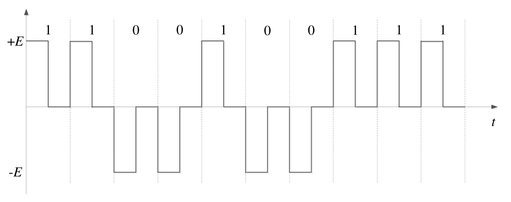

# [HITCN]哈工大2020秋计算机网络复习笔记

# 1 概述

## 1.1 计算机网络

### 1.1.1 计算机网络与Internet

**计算机网络**：计算机网络就是**互连的、自治的**计算机集合。

- 自治：无主从关系
- 互连：互联互通——通信链路。通过**交换网络**互连主机，在距离远、数量大时保证互连。

**Internet**：全球最大的**互联网络**。ISP(Internet Service Provider) 网络互连的“**网络之网络**”

- 数以百万计的互连的**计算设备集合**：
  - **主机 (hosts) = 端系统 (end systems)**
  - 运行各种网络应用
- **通信链路**：光纤, 铜缆, 无线电, 卫星……
- **分组交换**： 转发分组 (数据包)：**路由器 (routers)** 和**交换机 (switches)**

- **为网络应用提供通信服务的通信基础设施**：Web, VoIP, email, 网络游戏, 电子商务, 社交网络, …
- **为网络应用提供应用编程接口 (API)**：支持应用程序“连接”Internet，发送/接收数据。提供类似于邮政系统的数据传输服务

### 1.1.2 网络协议

>协议是计算机网络有序运行的重要保证
>
>任何通信或信息交换过程都需要规则
>
>协议规范了网络中所有信息发送和接收过程

**网络协议(network protocol)**：简称为协议，是为进行网络中的数据交换而建立的规则、标准或约定。

协议规定了通信实体之间所交换的消息的格式、意义、顺序以及针对收到信息或发生的事件所采取的“动作” (actions)

**协议的三要素**：

- **语法 (Syntax)**：数据与控制信息的结构或格式；信号电平
- **语义 (Semantics)**：需要发出何种控制信息；完成何种动作以及做出何种响应；差错控制
- **时序 (Timing)**：事件顺序；速度匹配

## 1.2 计算机网络结构

### 1.2.1 计算机网络结构

> 计算机网络由三部分构成：网络边缘、接入网络、网络核心

- **网络边缘**：主机、 网络应用
  - **主机(端系统)**：位于“网络边缘”，运行网络应用程序。如：Web, email
  - **客户/服务器(client/server)应用模型**：客户发送请求，接收服务器响应。如：Web应用，文件传输FTP应用
  - **对等(peer-peer, P2P)应用模型**：无 (或不仅依赖)专用服务器，通信在对等实体之间直接进行。如：Gnutella, BT, Skype, QQ

- **接入网络，物理介质**：有线或无线通信链路
  - 通过接入网络将网络边缘接入核心网 (边缘路由器)
  - **带宽：数据传输速率。**
  - 典型的接入网络：
    - 数字用户线路 (DSL)：利用已有的电话线连接中心局的DSLAM，一般上传下载带宽是不同的，因此被称为**非对称数字用户线路**
    - 电缆网络：频分多路复用——在不同频带 (载波)上传输不同频道。各家庭共享家庭至电缆头端的接入网络，不同于DSL的独占至中心局的接入。
    - 典型家庭网络的接入
    - 机构 (企业)接入网络 (Ethernet)：端系统通常直接连接以太网交换机 (switch)
    - 无线接入网络：通过**共享的**无线接入网络 (**基站 (base station)**或称为“**接入点 (access point)**”) 连接端系统与路由器
      - 无线局域网 (LANs)：同一建筑物内 (30m)；802.11b/g (WiFi)：11Mbps、54Mbps传输速率
      - 广域无线接入：通过电信运营商 (蜂窝网) ，接入范围在几十公里；3G、 4G: LTE、移动互联网；1 Mbps、10 Mbps、100Mbps

- **网络核心 (核心网络)**：互联的路由器 (或分组转发设备)；网络之网络
  - 网络核心的关键功能：**路由+转发**
  - 网络核心解决的基本问题：通过**数据交换 (Data Exchange)**实现数据从源主机通过网络核心送达目的主机

### 1.2.2 Internet结构

端系统通过接入ISP (access ISPs )连接到Internet：家庭、公司和大学ISPs

接入ISP必须进一步互连：这样任意两个主机才可以互相发送分组

- 通过 **IXP (Internet exchange point)** 互联
- 通过**对等链路 (peering link)** 互联

可能出现**区域网络** (regional networks)连接接入ISP和运营商ISP

**内容提供商网络**(content provider networks，如： Google、Microsoft等) 可能运行其自己的网络，并就近为端用户提供服务、内容


## 1.3 数据交换

### 1.3.1 电路交换

最典型电路交换网络：电话网络

电路交换的三个阶段：建立连接 (呼叫/电路建立)；通信；释放连接 (拆除电路)

电路交换的显著特点是**独占资源**的

电路交换网络通过**多路复用 (Multiplexing)**共享中继线

### 1.3.2 多路复用

多路复用(Multiplexing)：链路/网络资源 (如带宽)划分为“资源片”，将资源片分配给各路“呼叫” (calls)，每路呼叫独占分配到的资源片进行通信，资源片可能“闲置”(idle) (无共享)

典型多路复用方法：

- **频分多路复用** (frequency division multiplexing-FDM )：频分多路复用的各用户占用不同的带宽 (Hz) 资源，用户在分配到一定的频带后，在通信过程中自始至终都占用这个频带。

- **时分多路复用** (time division multiplexing-TDM )：将时间划分为一段段等长的时分复用帧 (TDM 帧)，每个用户在每个 TDM 帧中占用固定序号的时隙。每用户所占用的时隙周期性出现。时分复用的所有用户是在不同的时间占用相同的频带宽度。

- **波分多路复用** (Wavelength division multiplexing-WDM)：波分复用就是光的频分复用*

- **码分多路复用** (Code division multiplexing-CDM )：每个用户分配一个唯一的m bit码片序列(chipping sequence)，其中“0”用“-1”表示、“1”用“+1”表示，例如：S 站的码片序列：(–1 –1 –1 +1 +1 –1 +1 +1)；各用户使用相同频率载波，利用各自码片序列编码数据，**编码信号 = (原始数据) × (码片序列)**

  - 条件：各用户码片序列相互正交

  - 各用户生成编码信号以后，在信道中会相互叠加形成新的传输信号，在接收端则可以使用想接收用户的码片解码，如下

    

### 1.3.3 报文交换

报文：源 (应用)发送信息整体。比如：一个文件

报文交换直接整体发送一个文件

### 1.3.4 分组交换

分组：报文分拆出来的一系列相对较小的数据包

分组交换需要报文的拆分与重组，产生额外开销。

分组交换不像电路交换会申请特定的独占的链路资源，所以存在多个主机共享同一段链路资源 (分组序列不确定，按需共享链路)，因此称其为**统计多路复用** (Statistical Multiplexing)

报文交换与分组交换均采用**存储-转发 (store-and-forward)**交换方式。区别：

- 报文交换以完整报文进行“存储-转发”
- 分组交换以较小的分组进行“存储-转发”·	

### 1.3.5 性能比较

#### 1.3.5.1 报文交换 vs 分组交换

发送主机：接收应用报文 (消息) 拆分为较小长度为 L bits的分组 (packets)；在传输速率为R的链路上传输分组

分组传输延迟 (时延) (delay)=  L bits / R (bits/sec)

- 报文交换：
  - 报文长度为M bits
  - 链路带宽为R bps
  - 每次传输报文需要M/R秒
  - 跳步数：h
  - 路由器数：n
  - 报文交付时间：T = hM / R = (n+1)M / R
- 分组交换：
  - 报文被拆分为多个分组
  - 分组长度为L bits
  - 每个分组传输时延为L/R秒
  - 跳步数：h
  - 路由器数：n
  - 报文交付时间：**T = M / R + (h-1)L / R = M / R + nL / R**

#### 1.3.5.2 分组交换 vs 电路交换

分组交换允许更多用户同时使用网络——网络资源充分共享

分组交换适用于突发数据传输网络，资源充分共享，简单、无需呼叫建立，但可能产生**拥塞** (congestion)：分组延迟和丢失，所以需要协议处理可靠数据传输和拥塞控制。

## 1.4 计算机网络性能

**速率**即数据率(data rate)或称数据传输速率或比特率(bit rate)：单位时间 (秒)传输信息 (比特)量，计算机网络中最重要的一个性能指标。单位：b/s (或bps)、kb/s、Mb/s、Gb/s

> k=103、M=106、G=109

“**带宽**” (bandwidth) 原本指信号具有的频带宽度，即最高频率与最低频率之差，单位是赫兹 (Hz)。网络的“带宽”通常是数字信道所能传送的“**最高数据率**”，单位：b/s (bps)

**延迟/时延**(delay或latency)，四种分组延迟：

- d~proc~： 结点处理延迟 (nodal processing delay)
  - 差错检测
  - 确定输出链路
  - 通常< msec
- d~queue~： 排队延迟 (queueing delay)
  - 等待输出链路可用
  - 取决于路由器拥塞程度
  - R： 链路带宽(bps)、L： 分组长度 (bits)、a： 平均分组到达速率，流量强度 (traffic intensity)= La/R
    - La/R ~ 0： 平均排队延迟很小
    - La/R -> 1： 平均排队延迟很大
    - La/R > 1： 超出服务能力，平均排队延迟无限大！
- d~trans~： 传输延迟 (transmission delay)——车队通过收费站时间
  - L： 分组长度(bits)
  - R： 链路带宽 (bps)
  - d~trans~ = L/R
- d~prop~： 传播延迟 (propagation delay)——每台车从第一个收费站跑到第二个收费站用时
  - d： 物理链路长度
  - s： 信号传播速度 (~2×108 m/sec)
  - d~prop~ = d/s

**时延带宽积** = 传播时延 \* 带宽 = d~prop~ \* R  (bits)

> 链路的时延带宽积又称为**以比特为单位的链路长度**

**分组丢失 (丢包)**：队列缓存容量有限，分组到达已满队列将被丢弃 (即丢包)，丢弃分组可能由前序结点或源重发 (也可能不重发)

**丢包率**= 丢包数 / 已发分组总数

**吞吐量** (Throughput)：表示在发送端与接收端之间传送数据速率 (b/s)

- 即时吞吐量： 给定时刻的速率
- 平均吞吐量： 一段时间的平均速率

> 瓶颈链路 (bottleneck link)：端到端路径上，限制端到端吞吐量的链路。

## 1.5 计算机网络体系结构

网络体系结构是**从功能上描述**计算机网络结构，计算机网络体系结构简称网络体系结构 (network architecture) 是**分层结构**，每层遵循某个/些网络协议完成本层功能，计算机网络体系结构是计算机网络的各层及其协议的集合，体系结构是一个计算机网络的功能层次及其关系的定义，体系结构是抽象的。

实体(entity) 表示任何可发送或接收信息的硬件或软件进程。协议是控制**两个对等实体**进行通信的规则的集合，**协议是“水平的”**。任一层实体需要使用下层服务，遵循本层协议，实现本层功能，向上层提供服务，**服务是“垂直的”**。下层协议的实现对上层的服务用户是透明的。同系统的相邻层实体间通过接口进行交互，通过服务访问点 SAP(Service Access Point)，交换原语，指定请求的特定服务。

### 1.5.1 OSI参考模型

开放系统互连 (OSI)参考模型是由国际标准化组织 (ISO) 于1984年提出的分层网络体系结构模型，目的是支持**异构网络系统**的互联互通。

**OSI参考模型解释的通信过程**如下图，可以看出应用层、表示层、会话层、传输层是**端到端的**。


**数据封装**：增加控制信息，构造协议数据单元 (PDU)。控制信息主要包括:

- 地址（Address）: 标识发送端/接收端
- 差错检测编码（Error-detecting code）: 用于差错检测或纠正
- 协议控制（Protocol control）: 实现协议功能的附加信息，如: 优先级（priority）、服务质量（QoS）、 和安全控制等

**七层功能**：

- **应用层**（Application）：支持用户通过用户代理（如浏览器）或网络接口使用网络（服务）
- **表示层**（Presentation）：处理两个系统间交换信息的语法与语义（syntax and semantics ）问题
  - 数据表示转化：转换为主机独立的编码
  - 加密/解密
  - 压缩/解压缩
- **会话层**（Session）：对话控制（dialog controlling）：建立、维护
  - 同步：在数据流中插入“同步点”
  - 最“薄”的一层
- **传输层**（Transport）：负责源-目的（端-端）的（进程间） 完整报文传输
  - 分段与重组
  - SAP寻址：确保将完整报文提交给正确进程，如端口号
  - 连接控制
  - 流量控制
  - 差错控制
- **网络层**（Network）：负责源主机到目的主机数据分组（packet）传输，可能穿越多个网络
  - **逻辑寻址**（Logical addressing）：全局唯一逻辑地址，确保数据分组被送达目的主机，如IP地址
  - **路由**（Routing）：路由器（或网关）互连网络，并路由分组至最终目的主机
  - **转发**（Forwarding）
- **数据链路层**（Data link）：负责结点-结点（node-to-node）数据传输
  - **组帧**（Framing）
  - **物理寻址**（Physical addressing）：在帧头中增加发送端和/或接收端的物理地址标识数据帧的发送端和/或接收端
  - **流量控制**（Flow control）：避免淹没接收端
  - **差错控制**（Error control）：检测并重传损坏或丢失帧，并避免重复帧
  - **访问控制**（Access control）：在任一给定时刻决定哪个设备拥有链路（物理介质）控制使用权
- **物理层**（Physical）
  - 接口特性：机械特性、电气特性、功能特性、规程特性
  - 比特编码
  - 数据率
  - **比特同步**：时钟同步
  - 传输模式：单工（Simplex）——单向传输、半双工（half-duplex）——交替双向通信、全双工（full-duplex）——同时双向通信

### 1.5.2 TCP/IP参考模型


在TCP/IP参考模型下，是网络接口无关的，只要能封装成IP数据报，即可在网际传输。

### 1.5.3 五层参考模型

>综合 OSI 和 TCP/IP 的优点

- 应用层: 支持各种网络应用，FTP, SMTP, HTTP
- 传输层: 进程-进程的数据传输，TCP, UDP
- 网络层: 源主机到目的主机的数据分组路由与转发，IP协议、路由协议等
- 链路层: 相邻网络元素（主机、交换机、路由器等）的数据传输，以太网（Ethernet）、802.11 (WiFi)、PPP
- 物理层:比特传输

**5层参考模型下的网络通信过程与数据封装**


## 1.6 计算机网络发展历史

略


# 2 应用层

## 2.1 基本原理

### 2.1.1 网络应用的体系结构

- **客户机/服务器结构(Client-Server, C/S)**

  服务器：7*24小时提供服务；永久性访问地址/域名；利用大量服务器实现可扩展性

  客户机：与服务器通信，使用服务器提供的服务；间歇性接入网络；可能使用动态IP地址；不会与其他客户机直接通信

  > Web应用

- **点对点结构(Peer-to-peer, P2P)**

  没有永远在线的服务器，任意端系统/节点之间可以直接通讯，节点间歇性接入网络，节点可能改变IP地址

  优点在于**高度可伸缩**，缺点在于**难于管理**

  > 文件传输应用

- **混合结构(Hybrid)**

  文件传输使用P2P结构，文件的搜索采用C/S结构——集中式

  每个节点向中央服务器登记自己的内容，而在查找感兴趣的内容时向中央服务器提交查询请求

  > Napster

### 2.1.2 网络应用进程通信

**同一主机**上运行的进程之间由**操作系统提供进程间通信机制**

**不同主机**上运行的进程间靠**消息交换**通信，进程间通信**利用socket发送/接收消息**实现

- **进程寻址**：通过标识符(**IP地址+端口号**)在不同主机上的进程间通信

  - 使用IP地址对主机寻址

  - 为主机上每个需要通信的进程分配一个端口号，使用端口号对主机上的进程寻址

    > - HTTP Server: 80
    > - Mail Server：25

- **应用层协议**：网络应用需遵循应用层协议

  - **公开协议**：由RFC定义的，允许互操作的协议(HTTP、SMTP)

- **私有协议**：多数P2P文件共享应用

- **应用层协议内容**

  - 消息的类型(type)：请求消息、响应消息
  - 消息的语法(syntax)/格式：消息中有哪些字段(field)、每个字段如何描述
  - 字段的语义(semantics)：字段中信息的含义
  - 规则(rules)：进程何时发送/响应消息、进程如何发送/响应消息

### 2.1.3 网络应用的服务需求

- **数据丢失(data loss)/可靠性(reliability)**
  - 某些网络应用能够容忍一定的数据丢失：网络电话
  - 某些网络应用要求100%可靠的数据传输：文件传输，telnet
- **时间(timing)/延迟(delay)**
  - 有些应用只有在延迟足够低时才“有效”，如：网络电话/网络游戏
- **带宽(bandwidth)**
  - 某些应用只有在带宽达到最低要求时才“有效”：网络视频
  - 某些应用能够适应任何带宽——弹性应用：email

|               | **TCP服务**                                  | **UDP服务**      |
| ------------- | -------------------------------------------- | ---------------- |
| 连接          | 面向连接: 客户机/服务器进程间需要建立连接    | 无连接           |
| 传输          | 可靠的传输                                   | 不可靠的数据传输 |
| 流量控制      | 发送方不会发送速度过快，超过接收方的处理能力 | 不提供           |
| 拥塞控制      | 当网络负载过重时能够限制发送方的发送速度     | 不提供           |
| 时间/延迟保障 | 不提供                                       | 不提供           |
| 带宽保障      | 不提供最小带宽保障                           | 不提供           |


## 2.2 web应用

### 2.2.1 HTTP连接

- HTTP连接**使用TCP**传输服务：

  1. 服务器在80端口等待客户的请求

  2. 浏览器发起到服务器的TCP连接(创建套接字Socket)

  3. 服务器接受来自浏览器的TCP连接

  4. 浏览器(HTTP客户端)与Web服务器(HTTP服务器)交换HTTP消息

  5. 关闭TCP连接

- HTTP协议是**无状态的**，服务器不维护任何有关客户端过去所发请求的信息。

  > 有协议的更复杂，需要维护每个用户的历史信息状态，而且当客户或者服务器失效会产生状态的不一致，解决这种不一致代价高

| HTTP1.0                                                      | HTTP1.1                                                      |
| ------------------------------------------------------------ | ------------------------------------------------------------ |
| **非持久性连接**(Nonpersistent HTTP)<br/>每个TCP连接最多允许传输**一个对象** | **持久性连接**(Persistent HTTP)<br/>每个TCP连接允许传输**多个对象** |
| 每个对象需要2个RTT<br/>操作系统需要为每个TCP连接开销资源(overhead) | 发送响应后，服务器保持TCP连接的打开                          |

| 无流水(pipelining)的持久性连接           | 带有流水机制的持久性连接(HTTP 1.1的默认选项)   |
| ---------------------------------------- | ---------------------------------------------- |
| 客户端只有收到前一个响应后才发送新的请求 | 客户端只要遇到一个引用对象就尽快发出请求       |
| 每个被引用的对象耗时1个RTT               | 理想情况下，收到所有的引用对象只需耗时约1个RTT |

- **RTT**(Round Trip Time)：从客户端发送一个很小的数据包到服务器并返回所经历的时间

- **响应时间** = 建立TCP连接的1个RTT + 发送HTTP请求消息到HTTP响应消息的前几个字节到达的1个RTT + 响应消息中所含的文件/对象传输时间 = 2RTT + 文件发送时间

### 2.2.2 HTTP消息格式

#### 2.2.2.1 请求消息(request)


- HTTP 1.0
  - GET方法： 输入信息通过request行的URL字段上传
  - POST方法：网页经常需要填写表格(form)，在请求消息的消息体(entity body)中上传客户端的输
  - HEAD方法：请Server不要将所请求的对象放入响应消息中
- HTTP 1.1
  - GET, POST, HEAD
  - PUT：将消息体中的文件上传到URL字段所指定的路径
  - DELETE：删除URL字段所指定的文件

#### 2.2.2.2 响应消息(response)


HTTP响应状态代码，响应消息的第一行：

- 200 OK
- 301 Moved Permanently
- 400 Bad Request
- 404 Not Found
- 505 HTTP Version Not Supported

### 2.2.3 Cookie技术

> HTTP协议无状态，但很多应用需要服务器掌握客户端的状态

**Cookie技术**：某些网站为了辨别用户身份、进行session跟踪而储存在用户本地终端上的数据(通常经过加密)。

**Cookie的组件**：

- TTP响应消息的cookie头部行
- HTTP请求消息的cookie头部行
- 保存在客户端主机上的cookie文件，由浏览器管理
- Web服务器端的后台数据库

Cookie能够用于：身份认证、购物车、推荐、Web e-mail、……

> 但是cookie存在用户隐私泄露的问题

### 2.2.4 Web缓存/代理服务器技术：条件GET

> 为了**缩短客户请求的响应时间、减少机构/组织的流量、在大范围内(Internet)实现有效的内容分发**，所以提出了在不访问服务器的前提下满足客户端的HTTP请求的技术——Web缓存/代理服务器技术。

浏览器向缓存/代理服务器发送所有的HTTP请求：如果所请求对象在缓存中，缓存返回对象；否则，缓存服务器向原始服务器发送HTTP请求，获取对象，然后返回给客户端并保存该对象。所以缓存既充当客户端，也充当服务器，*一般由ISP(Internet服务提供商)架设*。

**条件性GET方法**

目标：如果缓存有最新的版本，则不需要发送请求对象

缓存：在HTTP请求消息中声明所持有版本的日期(在HTTP请求消息有 **If-modified-since: \<date\>**)

服务器：如果缓存的版本是最新的，则响应消息中不包含对象(响应消息为 **HTTP/1.0 304 Not Modified**)，如果不是最新的，正常返回请求对象

> 在HTTP响应消息中有一行 **`Last-Modified`** header line，表明最后一次的修改时间


## 2.3 Email应用

Email应用的构成组件

- 邮件客户端(user agent)：Client应用或者Web页面

- 邮件服务器

- SMTP协议(Simple Mail Transfer Protocol)：在邮件服务器之间传递消息使用的协议
  - 客户端：发送消息的服务器
  - 服务器：接收消息的服务器

### 2.3.1 SMTP协议

使用TCP在25端口建立持久性连接进行email消息的可靠传输，传输过程的三个阶段：握手、消息的传输、关闭。

**命令/响应交互模式**：

- 命令(command)：ASCII文本

- 响应(response)：状态代码和语句

Email消息只能包含7位ASCII码

SMTP服务器利用`CRLF.CRLF`确定消息的结束。

> SMTP与HTTP对比：
>
> - HTTP是拉式(pull)，而SMTP是推式(push)
>
> - HTTP的每个对象封装在独立的响应消息中，SMTP的多个对象在由多个部分构成的消息中发送
>
> - 都使用命令/响应交互模式
>
> - 命令和状态代码都是ASCII码

### 2.3.2 Email消息格式

Email消息由三部分组成：

- 头部行(header)
  - To
  - From
  - Subject
- 空白行
- 消息体：消息本身，只能是ASCII字符

而为了传输非文本类型的数据，对如上的消息做出了扩展。

**MIME：多媒体邮件扩展**。通过在邮件头部增加额外的行以声明MIME的内容类型。


### 2.3.3 邮件访问协议

邮件访问协议：从服务器获取邮件

- POP (Post Office Protocol)：认证/授权(客户端<---->服务器)和下载
- IMAP (Internet Mail Access Protocol)：更多功能、更加复杂、能够操纵服务器上存储的消息
  - 所有消息统一保存在一个地方：服务器
  - 允许用户利用文件夹组织消息
  - 支持跨会话(Session)的用户状态：文件夹的名字、文件夹与消息ID之间的映射等
- HTTP：163, QQ Mail等(网页版使用)

#### 2.3.3.1 POP3协议

- 认证过程
  - 客户端命令
    - User：声明用户名
    - Pass：声明密码
  - 服务器响应
    - +OK
    - -ERR
- 事务阶段
  - List：列出消息数量
  - Retr：用编号获取消息
  - Dele：删除消息
  - Quit

POP协议有两种模式：

- “下载并删除”模式：用户如果换了客户端软件，无法重读该邮件

- “下载并保持”模式：不同客户端都可以保留消息的拷贝


> **POP3是无状态的**

#### 2.3.3.2 IMAP协议

所有消息统一保存在一个地方：服务器

允许用户利用文件夹组织消息，支持跨会话(Session)的用户状态：文件夹的名字、文件夹与消息ID之间的映射等


## 2.4 DNS应用

DNS：Domain Name System 域名解析系统

- 多层命名服务器构成的分布式数据库
- 应用层协议：完成名字的解析。Internet核心功能，用应用层协议实现

DNS服务：域名向IP地址的翻译；主机别名；邮件服务器别名；Web服务器负载均衡

### 2.4.1 分布式层次式数据库

**根域名服务器**：本地域名解析服务器无法解析域名时，访问根域名服务器。

**顶级域名服务器**(TLD, top-level domain)：负责com, org, net,edu等顶级域名和国家顶级域名，例如cn, uk, fr等。

**权威(Authoritative)域名服务器**：组织的域名解析服务器，提供组织内部服务器的解析服务。组织或服务提供商负责维护。

**本地域名解析服务器**：不严格属于层级体系，每个ISP有一个本地域名服务器，是默认域名解析服务器。

当主机进行DNS查询时，查询被发送到本地域名服务器，作为代理(proxy)，将查询转发给(层级式)域名解析服务器系统。

- **迭代查询**：被查询服务器返回域名解析服务器的名字。“我不认识这个域名，但是你可以问题这服务器”
- **递归查询**：将域名解析的任务交给所联系的服务器

>只要域名解析服务器获得域名—IP映射，即缓存这一映射，一段时间过后，缓存条目失效(删除)
>
>本地域名服务器一般会缓存顶级域名服务器的映射，因此根域名服务器不经常被访问

### 2.4.2 DNS记录

资源记录(RR, resource records)，RR format: (Name, Value, Type, TTL)

- Type=A
  - Name：主机域名
  - Value：IP地址
- Type=NS
  - Name：域(edu.cn)
  - Value：该域权威域名解析服务器的主机域名

- Type=CNAME
  - Name：某一真实域名的别名，如 www.ibm.com – servereast.backup2.ibm.com
  - Value：真实域名
- Type=MX
  - Value是与name相对应的邮件服务器

### 2.4.3 DNS协议和消息格式

DNS协议：查询 (query) 和回复 (reply) 消息，消息格式相同

消息头部：

- Identification：16位查询编号，回复使用相同的编号
- flags：查询或回复、期望递归、递归可用、权威回答


为公司 “Network Utopia”注册域名：

- 在域名管理机构(如Network Solutions)注册域名networkutopia.com。向域名管理机构提供你的权威域名解析服务器的名字和IP地址，域名管理机构向com顶级域名解析服务器中插入两条记录

  `(networkutopia.com, dns1.networkutopia.com, NS)`

  `(dns1.networkutopia.com, 212.212.212.1, A)`

- 在权威域名解析服务器中为www.networkuptopia.com加入Type A记录，为networkutopia.com加入Type MX记录


## 2.5 FTP

file transfer protocol，基于C/S架构。

FTP有**两个连接，一个用于控制，一个用于数据传输**。FTP客户端使用TCP在端口21联系FTP服务器，通过控制连接授权客户端，客户端浏览远程目录，通过控制连接发送命令，当服务器接收文件传输命令时，服务器打开第二个TCP数据连接(用于文件)到客户端，传输一个文件后，服务器关闭数据连接。

控制连接被称为**带外传输**


## 2.6 P2P应用

### 2.6.1 原理

- 没有服务器
- 任意端系统之间直接通信
- 节点阶段接入Internet
- 节点可能更换IP地址

**问题**：从一个服务器向N个节点分发一个文件F需要多长时间？

- 设：
  - u~s~ ——服务器上传带宽
  - u~i~ ——节点i的上传带宽
  - d~i~ ——节点i的下载带宽

- **C/S架构**
  - 服务器发送N个副本的时间：NF/u~s~ 
  - 客户机i的下载时间：F/d~i~
  - 分发N个F所需时间：d~cs~=max{ NF/u~s~ , F/min{d~i~} }——时间关于N是**线性增长**的
- **P2P**
  - 服务器必须发送一个副本(最小的消耗时间)：F/u~s~
  - 客户机i的下载时间：F/d~i~
  - 下载总量：NF bits
  - 最快的上传速率(服务器和所有的节点都在上传)：u~s~ +  Σu~i~
  - 分发N个F所需要的时间：d~P2P~ = max { F/u~s~, F/min(d~i~) , NF/(u~s~ + Σu~i~) }——非线性的

### 2.6.2 文件分发：BitTorrent

- **洪流(torrent)**：参与一个特定文件分发的所有对等方的集合
- **文件块(chunk)**：一个洪流中的对等方下载等长度的文件块，典型长度**256KB**
- **追踪器(tracker)**：一个对等方加入一个洪流时，它向追踪器注册自己并周期性地通知追踪器它还在线

**BitTorrent**

- 文件划分为256KB的chunk

- 节点加入torrent时没有chunk，但是会逐渐积累；每个节点向tracker注册以获得节点清单，与某些节点(“邻居”)建立连接

- 下载的同时，节点需要向其他节点上传chunk

- 节点可能加入或离开：一旦节点获得完整的文件，它可能(自私地)离开或(无私地)留下

- 获取chunk

  - 给定任一时刻，不同的节点持有文件的不同chunk集合
  - 节点(Alice)定期查询每个邻居所持有的chunk列表
  - 节点发送请求，请求获取缺失的chunk：稀缺优先

- 发送chunk：tit-for-tat
  - Alice向正在向其发送Chunk且速率最快的4个邻居发送chunk：每10秒重新评估top 4
  - 每30秒随机选择一个其他节点，向其发送chunk：新选择节点可能加入top 4，“optimistically unchoke”

### 2.6.3 索引技术

#### 2.6.3.1 集中式索引

1. 节点加入时，通知中央服务器：**IP地址**和**内容**

2. Alice查找“Hey Jude”

3. Alice从Bob处请求文件

存在的问题：内容和文件传输是分布式的，但是内容定位是高度集中式的

- 单点失效问题
- 性能瓶颈
- 版权问题

#### 2.6.3.2 洪泛式查询：Query flooding

**完全分布式架构**(Gnutella采用这种架构)——每个节点对它共享的文件进行索引，且只对它共享的文件进行索引、

**覆盖网络**(overlay network)：Graph

- 节点X与Y之间如果有TCP连接，那么构成一个边

- 所有的活动节点和边构成覆盖网络

- 边：虚拟链路

- 节点一般邻居数少于10个

**查询消息**通过已有的TCP连接发送，节点转发查询消息，如果查询命中，则利用反向路径发回查询节点。

#### 2.6.3.3 层次是覆盖网络

介于集中式索引和洪泛查询之间的方法

每个节点或者是一个超级节点，或者被分配一个超级节点

节点和超级节点间维持TCP连接，某些超级节点对之间维持TCP连接

超级节点负责跟踪子节点的内容


## 2.7 Socket编程

### 2.7.1 应用编程接口(API)

> - 应用层(Application)：Web/RPC/中间件编程
>   - Socket编程
>   - NetBIOS编程——Windows
> - 传输层(Transport)
> - 网络层(Network)
>   - 基于NDIS网络编程——Windows
>   - 基于LibPcap/WinPcap、Libnet、Libnids、Libicmp编程
> - 数据链路层(Data link)
>   - 直接网卡编程，硬件相关的
>   - 基于Packet Driver编程，屏蔽网卡细节，适用于所有网卡
> - 物理层(Physical)

**API**：为了使应用层的应用进程可以和相邻层(传输层)传递数据，需要一个接口，即API。所以API就是**应用进程的控制权**和**操作系统的控制权**进行**转换**的一个系统调用接口

**典型的应用编程接口**：

- **socket interface(socket、套接字)**——Berkeley UNIX
- **Windows Socket Interface(WINSOCK)**——微软

- **Transport Layer Interface(TLI)**——AT&T  UNIX 系统 V

### 2.7.2 Socket API概述

- 标识通信端点(对外)：IP地址+端口号(16位整数)

- 操作系统/进程管理套接字(对内)：套接字描述符(socket descriptor)——小整数

**Socket抽象**

- 类似于文件的抽象：当应用进程创建套接字时，操作系统分配一个数据结构存储该套接字相关信息，操作系统返回套接字描述符

- 操作系统维护一个套接字描述符表，存储的是指向套接字数据结构的指针

- 地址结构：`sockaddr_in`

  ```c
  struct aockaddr_in
  {
  	u_char sin_len;				/*地址长度*/
      u_char sin_family;			/*地址族*/
      u_short sin_port;			/*端口号*/
      struct in_addr sin_addr; 	/*IP地址*/
      char sin_zero[8];			/*未用(置0)*/
  }
  ```

  > **地址族**：为了适应不同协议的变化，引入了地址族，其**在TCP/IP**下使用的值为**AF_INET**

### 2.7.3 Socket API函数

所有的API都是在WINSOCK中的，与UNIX下的socket大同小异

#### 2.7.3.1 WSAStartup

`int WSAStartup(WORD wVersionRequested, LPWSADATA lpWSAData);`

- 使用Socket的应用程序在使用Socket之前必须首先调用此函数加载DLL
- 第一个参数指明程序请求使用的**WinSock版本**：高位字节指明副版本、低位字节指明主版本
- 第二个参数是返回**实际的WinSock的版本信息**：指向WSADATA结构的指针

```c
/* 例 */
wVersionRequested = MAKEWORD(2, 1);
err = WSAStartup(wVersionRequested, &wsaData);
```

#### 2.7.3.2 WSACleanup

`int WSACleanup (void);`

应用程序在完成对请求的Socket库的使用，最后要调用WSACleanup函数**解除与Socket库的绑定**，**释放Socket库所占用的系统资源**

#### 2.7.3.3 socket

`sd = socket(protofamily,type,proto);`

- 用于创建套接字

- 操作系统返回**套接字描述符**(sd)
- 第一个参数指明**协议族**：在**TCP/IP下**为**PF_INET**
- 第二个参数指明**套接字类型**：在**TCP/IP下**可以为**SOCK_STREAM**、**SOCK_DGRAM**或**SOCK_RAW**
- 第三个参数指明**协议号**：默认为0，当某类套接字只面向一类协议时直接使用0即可，而面向多个协议时就需要指定协议号了

> Socket面向TCP/IP的服务类型
>
> 应用层 ----------- 应用进程
>
> ​                          /      |        \
>
> **SOCK_STREAM**     |    **SOCK_DGRAM**
>
> ​                /        **SOCK_RAW**        \
>
> 传输层--TCP             |                  UDP
>
> 网络层----------IP/ICMP/IGMP

#### 2.7.3.4 Closesocket

`int closesocket(SOCKET sd)`

- unix下该函数名是`close`，也就是关闭文件的函数
- 该函数是关闭描述符为sd的套接字
  - 但如果多个进程共享一个套接字，调用该函数是将套接字引用计数减1，减至0才关闭，它清除掉的只是该进程中对它的引用
  - 而一个进程中的多线程对一个套接字的使用是无计数的，也就是说，在一个线程中关闭了一个套接字意味着其他线程也不能再访问该套接字了

- 返回0表示成功，返回SOCKET_ERROR表示失败

#### 2.7.3.5 bind

`int bind(sd, localadr, addrlen);`

- 绑定套接字的本地端点地址：IP地址+端口号
  - 由于在创建SOCKET的时候可能没有对应的地址信息，所以要进行地址信息的绑定

- 客户程序一般不需要调用bind函数，操作系统自动设置
- 服务端需要绑定端口号，而不能绑定特定的IP，一旦绑定了特定IP意味着其他IP就不能访问该服务器了，所以为了解决该问题，服务端绑定的是一个地址通配符**INADDR_ANY**

#### 2.7.3.6 listen

`int listen(sd, queuesize);`

- C/S架构下将服务器端的流套接字置为监听状态，所以此函数**仅被服务器调用**，仅用于面向连接(TCP)的**流套接字**
- 第二个参数设置连接请求队列的大小，服务器从队列中提取
- 返回0表示成功，返回SOCKET_ERROR表示失败

#### 2.7.3.7 connect

`connect(sd,saddr,saddrlen);`

- 使客户套接字(sd)与特定计算机的特定端口(saddr)的套接字(服务)进行连接

- 仅用于**客户端**，可用于TCP客户端，也可用于UDP客户端
  - TCP客户端：建立TCP连接，客户端调用此函数对服务器发起连接请求
  - UDP客户端：指定服务器端点地址，UDP是无连接的，所以即使调用`commect` 成功，也有可能无法与服务器通信

#### 2.7.3.8 accept

`newsock = accept(sd,caddr,caddrlen);`

- 服务程序调用`accept`从处于监听状态的流套接字sd的客户连接请求队列中取出排在最前的一个客户请求，并且**创建一个新的套接字**来与客户套接字创建连接通道
  - 如果直接使用服务器的主套接字则服务器在同一时刻只能与一个客户端连接，所以使用创建新套接字来达到并行连接的目的(并发的TCP服务器)

- 仅用于**服务器**，仅用于**TCP套接字**

#### 2.7.3.9 send, sendto

`send(sd,*buf,len,flags);`

`sendto(sd,*buf,len,flags,destaddr,addrlen);`

- `send`是没有指定服务器的地址的，也就是说连接已经建立了，故可用于：
  - TCP套接字(客户端与服务器端均可)
  - 调用了 `connect` 的UDP客户端的套接字(连接模式的UDP套接字)
- `sendto`函数用于UDP服务器端套接字与未调用`connect`函数的UDP客户端套接字

#### 2.7.3.10 recv, recvfrom

`recv(sd,*buffer,len,flags);`

`recvfrom(sd,*buf,len,flags,senderaddr,saddrlen);`

- `recv`函数从**TCP连接的另一端**接收数据，或者从**调用了`connect`函数的UDP客户端套接字**接收服务器发来的数据
- `recvfrom`函数用于从**UDP服务器端套接字**与**未调用`connect`函数的UDP客户端套接字**接收对端数据

#### 2.7.3.11 setsockopt, getsockopt

`int setsockopt(int sd, int level, int optname, *optval, int optlen);`

`int getsockopt(int sd, int level, int optname, *optval, socklen_t *optlen);`

- `setsockopt`函数用来设置套接字sd的选项参数
- `getsockopt`函数用于获取任意类型、任意状态套接口的选项当前值，并把结果存入optval

### 2.7.4 网络字节顺序

由于五层网络模型中不存在表示层，所以无法进行不同机器间的表示转化，于是TCP/IP定义了标准的用于协议头中的二进制整数表示：**网络字节顺序(network byte order)**

某些Socket API函数的**参数**需要**存储为网络字节顺序**(如IP地址、端口号等)，因此实现本地字节顺序与网络字节顺序间转换的函数有：

- **htons**：本地字节顺序→网络字节顺序(16bits)
- **ntohs**：网络字节顺序→本地字节顺序(16bits)
- **htonl**：本地字节顺序→网络字节顺序(32bits)
- **ntohl**：网络字节顺序→本地字节顺序(32bits)

### 2.7.5 客户端软件设计

#### 2.7.5.1 解析服务器IP地址

由于客户端可能使u用域名或IP地址来标识服务器，而IP协议需要32位的二进制IP地址，所以需要将域名或IP地址转换为32位的IP地址。

- 函数`inet_addr()` 实现点分十进制IP地址到32位IP地址转换
- 函数`gethostbyname()` 实现域名到32位IP地址转换，返回一个指向结构**hostent**的指针

以上两个函数得到的已经是网络字节顺序，可以直接使用。

#### 2.7.5.2 解析服务器端口号

客户端还可能使用服务名(如HTTP)标识服务器端口，因此需要将服务名转换为熟知端口号。

- 函数`getservbyname()`，返回一个指向结构**servent**的指针

#### 2.7.5.3 解析协议号

客户端可能使用协议名(如:TCP)指定协议，因此需要将协议名转换为协议号(如：6)

- 函数`getprotobyname()`实现协议名到协议号的转换，返回一个指向结构**protoent**的指针

#### 2.7.5.4 TCP/UDP客户端软件流程

**TCP**：

1. 确定服务器**IP地址**与**端口号**

2. 创建套接字
3. *分配本地端点地址(IP地址+端口号)*——不需要设计软件时手动来做，系统自动完成
4. 连接服务器(套接字)——`connect()`
5. 遵循应用层协议进行通信——根据协议确定客户端和服务器哪方先发信息
6. 关闭/释放连接

**UDP**：

1. 确定服务器**IP地址**与**端口号**——并非只是每次的第一步做，之后可能每次都需要做
2. 创建套接字
3. *分配本地端点地址(IP地址+端口号)*——自动完成
4. 指定服务器端点地址，构造UDP数据报——`connect()`，构造的UDP数据报可以发给不同的服务器，此时需要重复做第一步
5. 遵循应用层协议进行通信——一定是UDP客户端先给服务器发信息
6. 关闭/释放套接字

### 2.7.6 服务器软件设计

- **循环无连接**(Iterative connectionless)服务器，基本流程：

  1. 创建套接字
  2. 绑定端点地址(INADDR_ANY+端口号)
  3. 反复接收来自客户端的请求
  4. 遵循应用层协议，构造响应报文，发送给客户

  > 数据发送：
  >
  > - 服务器端不能使用`connect()`函数
  > - 无连接服务器使用`sendto()`函数发送数据报
  >
  > 获取客户端点地址：
  >
  > - 调用`recvfrom()`函数接收数据时，自动提取

- **循环面向连接**(Iterative connection-oriented)服务器，基本流程：

  1. 创建(主)套接字，并绑定熟知端口号；
  2. 设置(主)套接字为被动监听模式，准备用于服务器；
  3. 调用`accept()`函数接收下一个连接请求(通过主套接字)，创建新套接字用于与该客户建立连接；
  4. 遵循应用层协议，反复接收客户请求，构造并发送响应(通过新套接字)；
  5. 完成为特定客户服务后，关闭与该客户之间的连接，返回步骤3.

- **并发无连接**(Concurrent connectionless)服务器，基本流程：

  - 主线程1：创建套接字，并绑定熟知端口号；

  - 主线程2：反复调用`recvfrom()`函数，接收下一个客户请求，并创建新线程处理该客户响应；

  - 子线程1：接收一个特定请求；

  - 子线程2：依据应用层协议构造响应报文，并调用`sendto()`发送；

  - 子线程3：退出(一个子线程处理一个请求后即终止)。

- **并发面向连接**(Concurrent connection-oriented)服务器，基本流程：

  - 主线程1：创建(主)套接字，并绑定熟知端口号；

  - 主线程2：设置(主)套接字为被动监听模式，准备用于服务器；

  - 主线程3：反复调用`accept()`函数接收下一个连接请求(通过主套接字)，并创建一个新的子线程处理该客户响应；

  - 子线程1：接收一个客户的服务请求(通过新创建的套接字)；

  - 子线程2：遵循应用层协议与特定客户进行交互；

  - 子线程3：关闭/释放连接并退出(线程终止)。

> 客户端与服务器的实现范例参见PPT


# 3 传输层

网络层提供**主机之间**的逻辑通信机制，而传输层提供**应用进程之间**的逻辑通信机制

## 3.1 多路复用和多路分用

- **多路复用**（发送端）：从多个Socket接收数据，为每块数据封装上头部信息，生成Segment，交给网络层
- **多路分用**（接收端）：传输层依据头部信息将收到的Segment交给正确的Socket，即不同的进程**工作方式**：
  1. **主机接收IP数据报**：每个**数据报**携带**源IP地址**和**目的IP地址**，还携带一个**传输层的段**(Segment)，每个段携带**源端口号**和**目的端口号**
  2. 收到Segment之后，传输层协议**提取IP地址和端口号**信息，将Segment**导向相应的Socket**：网络层不关心端口号信息

### 3.1.1 无连接的多路分用

- 利用端口号创建Socket
- **UDP的Socket用二元组**标识：(**目的IP地址，目的端口号**)
- 主机收到UDP段后检查段中的目的端口号，将UDP段导向绑定在该端口号的Socket，所以只要目的IP和目的端口号相同，来自不同源IP地址和/或源端口号的IP数据包被导向同一个Socket

### 3.1.2 面向连接的多路分用

- **TCP的Socket用四元组**标识：(**源IP地址，源端口号，目的IP地址，目的端口号**)

- 接收端利用所有的四个值将Segment导向合适的Socket

- 服务器可能同时支持**多个TCP Socket**，每个Socket用自己的四元组标识：Web服务器为每个客户端开不同的Socket，可能创建**多个进程**，每个进程一个Socket；也可能创建**多个线程**，每个线程一个Socket


## 3.2 无连接传输协议UDP

UDP基于IP协议,解决了**复用/分用**、**简单的错误校验**两个问题，UDP协议不可靠，数据可能丢失，可能非按序到达

>在应用层增加可靠性机制以实现可靠的数据传输（增加了实现难度）

无连接：UDP发送方和接收方之间不需要握手；每个UDP段的处理独立于其他段

- **优点**：无连接**减少了延迟**（DNS使用UDP的原因），并且无需维护连接状态因此**实现起来也简单**；头部**开销少**；没有拥塞控制，**应用可更好地控制**发送时间和速率

- **用途**：流媒体应用、DNS、SNMP

- **UDP报文段格式**：

  |              源端口号             | 目的端口号 |

  | UDP段(包含头部)的长度 |     校验和     |

  |                  应用数据（消息）                  |

- **校验和checksum**

  > 目的：检测UDP段在传输中是否发生错误（如位翻转）

  发送方：计算前将校验和字段设为全0，然后将段的内容视为16-bit整数，(**校验和计算**)计算所有整数的和，进位加在和的后面，将得到的值按位求反，得到校验和；将校验和放入校验和字段

  接收方：计算所收到段的校验和，将其与校验和字段进行对比：不相等——检测出错误；相等——没有检测出错误（但可能有错误）


## 3.3 可靠数据传输

信道的不可靠特性决定了可靠数据传输协议(RDT)的复杂性

### 3.3.1 可靠数据传输原理

1. 发送方调用`rdt_send()` 将待发送数据交给可靠数据传输协议

2. 可靠数据传输协议调用 `udt_send()` 将数据发送给传输层

3. 数据发送到接收方的传输层，调用`rdt_rcv()` 将数据传给可靠数据传输协议

4. RDT整理后调用`deliver_data`将完整的数据发给接收方上层应用

第2、3步的通信都是双向的，以保证传输数据的完整性（可靠性）

### 3.3.2 RDT

#### 3.3.2.1 RDT1.0

***可靠信道上的可靠数据传输协议***

假设底层信道完全可靠，无丢失无错误，因此双方无需进行控制信息的传递，发送方只需把消息发送一次即可，接收方收到的消息即是完整的消息。

#### 3.3.2.2 RDT2.0

***可能产生位错误的信道上的可靠数据传输协议***

利用**校验和**检测底层信道可能翻转分组中的**位错误**，双方要进行控制信息的传递以**纠正错误**：

- **ACK** (确认机制)——接收方显式地告知发送方分组已正确接收；
- **NAK**——接收方显式地告知发送方分组有错误，发送方收到NAK后，重传分组

基于这种重传机制的rdt协议称为**ARQ(Automatic Repeat reQuest)协议**

> **Rdt 2.0中引入的新机制：差错检测；接收方反馈控制消息: ACK/NAK；重传**
>
> 在实现的过程中，利用了**停-等协议**，即发送方发送了一个packet后，只有在收到来自接收方的确认消息后才能继续下一步操作。

#### 3.3.2.3 RDT2.1、2.2

在RDT2.0中没有**ACK/NAK消息发生错误/被破坏**的处理方案，于是提出了新的解决方案

- RDT2.1

  如果ACK/NAK坏掉发送方就重传，但这有可能会产生重复分组，所以RDT2.1为每个分组增加了序列号（使用0，1标识——基于停-等协议），所以接收方可以根据序列号丢弃重复分组

  相比与2.0，发送方为每个分组增加了序列号，并且需要检验ACK/NAK消息是否发生错误，而且由于状态必须“记住”“当前”的分组，所以序列号FSM的状态数量翻倍；接收方需要判断分组是否重复即是否收到了期望的序列号

- RDT2.2：无NAK消息协议

  在RDT2.1的基础上删除NAK，接收方通过ACK告知最后一个被正确接收的分组，在ACK消息中显式地加入被确认分组的序列号，发送方收到重复ACK之后，处理方式与收到NAK相同，重传当前分组

#### 3.3.2.4 RDT3.0

***如果信道既可能发生错误，也可能丢失分组***

在这个协议中，引入了**定时器**，发送方会等待合理的时间，如果时间内未收到ACK，则重传，而如果分组只是延迟而不是丢了也同样会引发重传，但序列号机制能够处理这种问题

>Rdt 3.0能够正确工作，但由于停-等操作规定了需要等待接收方响应之后才进行下一步操作，所以性能很差

### 3.3.3 滑动窗口协议

#### 3.3.3.1 流水线机制与滑动窗口协议

由于RDT3.0的性能限制在于等待ACK消息的过程中带宽资源闲置，所以在流水线机制下，允许发送方在收到ACK之前连续发送多个分组，因而也需要更大的序列号范围，发送方/接收方需要更大的存储空间以缓存分组

**滑动窗口协议 (Sliding-window protocol)**：窗口是允许的序列号的范围，窗口尺寸为N表示最多有N个等待确认的消息。随着协议的运行，窗口在序列号空间内向前滑动（序列号会越来越大）。

> 主要的滑动窗口协议：GBN、SR

#### 3.3.3.2 GBN（Go-Back-N）

**发送方**：分组头部包含k-bit的序列号，窗口尺寸为N，即最多允许N个分组未确认，如果上层应用发来的数据没有可用的序列号时调用`refuse_data(data)` 拒绝。

**ACK(n)**：确认到序列号n(包含n)的分组均已被正确接收——**累积确认**

为空中的分组设置计时器(timer)，超时Timeout(n)事件：**重传序列号大于等于n**，还未收到ACK的所有分组

**接收方**：无缓存，只需要记住唯一的expectedseqnum (期望序列号)，对于乱序到达的分组直接丢弃，重新确认序列号最大的、按序到达的分组

ACK机制: 发送拥有最高序列号的、已被正确接收的分组的ACK

#### 3.3.3.3 SR (Selective Repeat)

GBN的丢失信息会导致所有序列号高于已经确认的序列号的包全部重发，因而造成资源浪费。在GBN的基础上改进得SR协议：

- 发送方只重传那些没收到ACK的分组，为每个分组设置定时器

- 接收方对每个分组**单独进行确认**，设置缓存机制，**缓存乱序到达的分组**，设置一个接收方窗口，将乱序到达的分组缓存，等待前面的分组到达后与前面的分组一起合并和交给上层
  - 收到在窗口内的分组时先发送ACK(n)，再判断是不是乱序到达的分组，是就缓存，不是就合并交付移动窗口
  - 收到窗口左侧的分组发送ACK(n)
  - 收到窗口右侧的分组忽略

序列号空间大小与窗口尺寸需满足：**N~S~+N~R~<=2^k^**


## 3.4 TCP

### 3.4.1 TCP段结构

### 3.4.1.1 TCP段结构


#### 3.4.1.2 序列号

序列号是segment中第一个字节的编号，而不是segment的编号（$NextSeqNum = SeqNum + length(data)$）

建立TCP时，双方随机选择序列号

#### 3.4.1.3 ACK

指的是希望接收到的下一个字节的序列号

使用的是累计确认机制（该序列号之前的所有字节均已被正确接收到）

> 关于乱序到达的Segment，TCP规范中没有规定，由TCP的实现者做出决策

### 3.4.2 TCP可靠数据传输

TCP在**IP层提供的不可靠服务基础上**实现**可靠数据传输**服务，使用了以下机制

- 流水线机制

- 累积确认

- TCP使用单一重传定时器。触发重传的事件：超时；收到重复ACK

#### 3.4.2.1 RTT和超时

为了设置定时器的超时时间，必须参考网络的RTT时间，而RTT是变化的，所以必须测量RTT

SampleRTT：测量从段发出去到收到ACK的时间。多次测量取平均值得到估计值EstimatedRTT（指数加权移动平均）：

$EstimatedRTT = (1- \alpha)*EstimatedRTT + \alpha*SampleRTT$ （$\alpha$一般取0.125）

**超时时间设置为：EstimatedRTT+ 安全边界**。所以如果EstimatedRTT变化大就意味着需要设置较大的边界，所以就需要测量RTT的变化值：SampleRTT与EstimatedRTT的差值：

$DevRTT = (1- \beta)*DevRTT +\beta *|SampleRTT-EstimatedRTT|$

所以超时时间的设置：$TimeoutInterval = EstimatedRTT + 4*DevRTT$

#### 3.4.2.2 发送方

从应用层收到数据：创建Segment（设置序列号）-->开启计时器-->设置超时时间：

超时事件：重传**引起超时的Segment**，重启定时器

收到ACK：如果确认此前未确认的Segment，更新滑动窗口（SendBase），如果窗口中还有未被确认的分组，重新启动定时器。

#### 3.4.2.3 接收方ACK生成

| 接收方事件                              | 接收方TCP动作                                          |
| --------------------------------------- | ------------------------------------------------------ |
| 收到按序到达的段（之前无等待发ACK的段） | 等待500ms，看是否有下一个段到达，如果没有就直接发送ACK |
| 收到按序到达的段（之前有等待发ACK的段） | 立即发送它的确认消息                                   |
| 收到乱序到达的段                        | 立即发送重复的ACK消息，声明期望的段                    |

#### 3.4.2.4 快速重传机制

TCP的实现中，如果发生超时，超时时间间隔将重新设置，即将超时时间间隔加倍，导致其很大，所以重发丢失的分组之前要等待很长时间使之超时。

Sender会连续地发送多个分组，如果某个分组丢失，可能会引发多个重复的ACK，所以可以**通过重复ACK检测分组丢失**。如果sender收到对同一数据的**3个ACK**，则假定该数据之后的段已经丢失。

**快速重传**：在定时器超时之前即进行重传。

> 问题：为什么是收到**3**次相同的ACK？

### 3.4.3 TCP流量控制

接收方为TCP连接分配缓冲区(buffer)，而上层应用可能处理buffer中数据的速度较慢，所以就需要**流量控制**以保证发送方不会传输的太多、太快以至于淹没接收方（buffer溢出）。

流量控制实际上是**速度匹配**机制。

假定TCP receiver丢弃乱序的段，则Buffer中的可用空间(spare room)= RcvWindow= RcvBuffer-[LastByteRcvd -LastByteRead]

Receiver通过在段的头部字段将RcvWindow 告诉Sender

Sender限制自己已经发送的但还未收到ACK的数据不超过接收方的RcvWindow尺寸

Receiver告知Sender RcvWindow=0，这会导致即使Reciver空闲了也无法通知Sender，所以需要一个机制来使Sender可以发送一个小的段从而可以带回Reciver的信息，避免了上面的死锁。

### 3.4.4 TCP连接管理

TCP sender和receiver在传输数据前需要建立连接

初始化TCP变量：如分配序列号、分配缓存区、交换流量控制信息。

#### 3.4.4.1 TCP建立：三次握手

Client：连接发起者

Server: 等待客户连接请求

1. Client主机向Server发送一个TCP **SYN** segment：

   > SYN=1, seq=client_isn

   - 不携带数据
   - SYN标志位置1
   - 传递选择的初始序列号

2. Server主机收到SYN，同意建立连接，回复SYNACK段

   > SYN=1, seq=serever_isn, ack=client_isn+1

   - Server分配buffer
   - 选择Server端的初始序列号，并告知Client

3. Client收到SYNACK，答复ACK段，SYN标志不再位置1，也可包含数据。

   > SYN=0, seq=client_isn+1, ack=server_isn+1

#### 3.4.4.2 TCP关闭

Client和Server都可发起关闭请求，多数是客户机发起。

1. Client向server发送TCP FIN 控制segment
2. Server收到FIN, 回复ACK. 关闭连接, 发送FIN.
3. Client收到FIN, 回复ACK。进入“等待” ——如果收到FIN，会重新发送ACK
4. Server收到ACK. 连接关闭.

#### 3.4.4.3 TCP生命周期

TCP客户端：


TCP服务端：


## 3.5 拥塞控制

拥塞的表现：

- 分组丢失（路由器缓存溢出）
- 分组延迟过大（在路由器缓存中排队）

### 3.5.1 拥塞的成因和代价

$\lambda_{in}$：实际需要发送的数据

$\lambda'_{in}$：实际需要发送的数据+需要重传的数据

$\lambda_{out}$：实际接收的数据

- 两个senders，两个receivers，一个路由器且无限缓存：这种条件下不需要重传，但拥塞时**分组延迟太大**。对于路由器：$\lambda_{in} = \lambda_{out}$

- 两个senders，两个receivers，一个路由器且有限缓存：可能丢包，所以Sender需要重传分组。对于路由器：

  - 情况a：Sender能够通过某种机制获知路由器buffer信息，有空闲才发。$\lambda_{in}=\lambda'_{in}=\lambda_{out}$

- 情况b：丢失后才重发。$\lambda'_{in}>\lambda_{out}$

  - 情况c：分组丢失和定时器超时后都重发，$\lambda'_{in}$变得更大

  由于**重传**，网络要做更多的工作，**造成了资源的浪费**。

- 四个发送方，多跳：可能丢包或超时都会引起重传。当拥塞时，一个分组被drop，任何用于该分组的**“上游”传输能力全都被浪费**掉


### 3.5.2 拥塞控制的方法

#### 3.5.2.1 端到端拥塞控制

网络层**不需要显式的提供支持**，端系统通过观察loss，delay等网络行为判断是否发生拥塞。TCP采取这种方法。

#### 3.5.2.2 网络辅助的拥塞控制

路由器向发送方**显式地反馈网络拥塞信息**，通过简单的拥塞指示（1bit：SNA, DECbit, TCP/IP ECN, ATM）指示发送方应该采取何种速率

#### 3.5.2.3 ATM ABR拥塞控制

**ABR **(available bit rate)：

- 如果发送方路径“underloaded”，使用可用带宽

- 如果发送方路径拥塞，将发送速率降到最低保障速率

**RM **(resource management) cells：

- 发送方发送

- 交换机设置RM cell位(网络辅助)
  - NI bit: rate不许增长
  - CI bit: 拥塞指示

- RM cell由接收方返回给发送方

**RM cell中显式的速率(ER)字段**：两个字节。拥塞的交换机可以将ER置为更低的值，发送方获知路径所能支持的最小速率

**数据cell中的EFCI位**：拥塞的交换机将其设为1，如果RM cell前面的data cell的EFCI位被设为1，那么发送方在返回的RM cell中置CI位

### 3.5.3 TCP拥塞控制

Sender限制发送速率：$LastByteSent-LastByteAcked<= CongWin$，则速率 $rate ≈\frac{CongWin}{RTT}\ Bytes/sec$

CongWin（发送窗口）保证了动态调整以改变发送速率，它反映所感知到的网络拥塞。

**感知网络拥塞**：Loss事件=timeout或3个重复ACK。发生loss事件后，发送方降低速率。

**调整发送速率**：加性增—乘性减；慢启动

#### 3.5.3.1 加性增—乘性减: AIMD

**原理**：逐渐增加发送速率，谨慎探测可用带宽，直到发生loss，一旦发生loss，速率直接减半。

**方法**: AIMD

- **Additive Increase**：每个RTT将CongWin增大一个MSS——拥塞避免

- **Multiplicative Decrease**：发生loss后将CongWin减半

#### 3.5.3.2 TCP慢启动: SS

**原理**：当连接开始时，指数性增长——收到每个ACK将CongWin加1 (即每个RTT将CongWin翻倍)。初始速率很慢，但是快速攀升。当CongWin达到Loss事件前值的1/2时，触发**拥塞避免**机制，**指数性增长切换为线性增长**。

**实现方法**：**Threshold**变量。Loss事件发生时，Threshold被设为Loss事件前CongWin值的1/2，然后开始线性增长。

**Loss事件处理**

- 3个重复ACKs：**CongWin切到一半**然后线性增长

- Timeout事件：**CongWin直接设为1个MSS**，然后指数增长，达到threshold后, 再线性增长。

- > 3个重复ACKs表示网络还能够传输一些 segments，而timeout事件表明拥塞更为严重。

### 3.5.4 TCP性能分析

**TCP吞吐率**

- 忽略掉Slow start，假定发生超时时CongWin的大小为W，吞吐率是W/RTT

- 超时后，CongWin=W/2，吞吐率是W/2RTT

- 平均吞吐率为：0.75W/RTT

**TCP的公平性**

- **公平**：如果K个TCP Session共享相同的瓶颈带宽R，那么每个Session的平均速率为R/K。TCP是公平的。

- **公平性与UDP**：多媒体应用通常不使用TCP，以免被拥塞控制机制限制速率。使用UDP的话可以以恒定速率发送，能够容忍丢失，于是产生了不公平。

- **公平性与并发TCP连接**：某些应用会打开多个并发连接，如Web浏览器，于是产生公平性问题。

  > 例子：链路速率为R，已有9个连接，新来的应用请求1个TCP，获得R/10的速率，新来的应用请求11个TCP，获得R/2的速率


# 4 网络层

## 4.1 网络层服务

网络层：从发送主机向接收主机传送数据段（segment），发送主机将数据段封装到数据报（datagram）中；接收主机向传输层交付数据段（segment）。每个主机和路由器都运行网络层协议（**非端到端的**），路由器检验所有穿越它的IP数据报的头部域，以决策如何处理IP数据报。

网络层**核心功能：转发与路由**

- 转发(forwarding)：将分组从路由器的输入端口转移到合适的输出端口
  - 转发表确定在本路由器如何转发分组
- 路由(routing)：确定分组从源到目的经过的路径
  - 路由算法(协议)（routing algorithms）确定通过网络的端到端路径

>某些网络（如ATM, 帧中继, X.25）的重要功能：**连接建立**——数据分组传输之前两端主机需要首先建立虚拟/逻辑连接。网络设备（如路由器）参与连接的建立。
>
>网络层连接与传输层连接的**对比**：
>
>- 网络层连接：两个主机之间 (路径上的路由器等网络设备参与其中)
>
>- 传输层连接：两个应用进程之间（对中间网络设备透明）

**无连接服务(connection-less service)**：如**数据报网络(datagram network)**

- 不事先为系列分组的传输确定传输路径

- 每个分组独立确定传输路径

- 不同分组可能传输路径不同 

**连接服务(connection service)**：如**虚电路网络(virtual-circuit network)**

- 首先为系列分组的传输确定从源到目的经过的路径 (建立连接)

- 然后沿该路径（连接）传输系列分组，系列分组传输路径相同

- 传输结束后拆除连接

>数据报网络与虚电路网络是典型两类分组交换网络
>
>类似于传输层的无连接服务（UDP）和面向连接服务（TCP），但是网络层服务**既有主机到主机的服务，也有网络核心的实现**

## 4.2 虚电路网络

**虚电路：一条从源主机到目的主机，类似于电路的路径(逻辑连接)**

- 分组交换

- 每个分组的传输利用链路的全部带宽（实际的电路交换利用的是链路的部分资源，频率或时隙等）

- 源到目的路径经过的网络层设备共同完成虚电路功能

**通信过程**：呼叫建立(call setup)→数据传输→拆除呼叫

- 1.初始呼叫 --> 2. 呼叫到达 --> 3.接受呼叫 --> 4.呼叫建立 --> 5.数据流开始 --> 6.接收数据

每条虚电路包括：

1. 从源主机到目的主机的一条路径
2. 虚电路号 (VCID)， 沿路每段链路一个编号
3. 沿路每个网络层设备（如路由器），**利用转发表记录经过的每条虚电路**
   - 沿某条虚电路传输的分组，**携带对应虚电路的VCID，而不是目的地址**。因为同一条VC ，在每段链路上的VCID通常不同。路由器转发分组时依据转发表改写/替换虚电路号。

**虚电路经过的每个网络设备（如路由器），维护每条经过它的虚电路连接状态**

链路、网络设备资源(如带宽、缓存等)可以面向VC进行预分配

**虚电路信令协议(signaling protocols)**：用于VC的建立、维护与拆除 (路径选择)；应用于虚电路网络，如ATM、帧中继 (frame-relay) 网络等；目前的Internet不采用

## 4.3 数据报网络

数据报网络是网络层无连接的，所以**每个分组携带目的地址**，路由器根据分组的目的地址转发分组。

路由器基于路由协议/算法构建转发表，检索转发表转发数据报，而转发表更新导致了每个分组独立选路。

转发表确定在本路由器如何转发分组，所以对于Internet网络来说，路由器就需要保存40多亿IP地址，显然检索效率会大大降低，所以它**维护的是一个地址范围**(聚合转发表入口)。如：

| 目的地址范围                                                 | 链路接口 |
| ------------------------------------------------------------ | -------- |
| 从11001000 00010111 00010**000 00000000**<br/>至11001000 00010111 00010**111 11111111** | 0        |
| 从11001000 00010111 000110**00 00000000**<br/>至11001000 00010111 000110**11 11111111** | 1        |
| 从11001000 00010111 000111**00 00000000**<br/>至11001000 00010111 000111**11 11111111** | 2        |
| 其他（默认路由，默认路径）                                   | 3        |

**最长前缀匹配优先**：在检索转发表时，优先选择与分组目的地址匹配前缀最长的入口（entry）。

数据报网络与VC网络对比：

| Internet (数据报网络)                                    | ATM (VC网络)                                                 |
| -------------------------------------------------------- | ------------------------------------------------------------ |
| 链路类型众多，特点、性能各异，统一服务困难               | 电话网络演化而来                                             |
| 计算机之间的数据交换：<br/>“弹性”服务，没有严格时间需求  | 核心业务是实时对话：<br/>严格的时间、可靠性需求，需要有保障的服务 |
| “智能”端系统 (计算机)<br/>可以自适应、性能控制、差错恢复 | “哑(dumb)” 端系统（非智能）<br/>电话机、传真机               |
| 简化网络，复杂“边缘”                                     | 简化“边缘”，复杂网络                                         |

## 4.4 IP协议

Internet网络层主机、路由器网络层主要功能：

- **路由协议**进行路径选择，生成路由表

- **IP协议**做出了寻址规约(conventions)，定义了数据报(分组)格式以及分组处理规约

- **ICMP(互联网控制报文)协议**提供差错报告、路由器“信令”

> ICMP协议相当于IP协议的伴随协议，实现IP协议的同时一般也要实现ICMP协议

### 4.4.1 IP数据报

<table>
    <tr>
        <td>0</td><td/><td/><td/>
        <td>4</td><td/><td/><td/>
        <td>8</td><td/><td/><td/>
        <td>12</td><td/><td/><td/>
        <td>16</td><td/><td/><td/>
        <td>20</td><td/><td/><td/>
        <td>24</td><td/><td/><td>31</td>
    </tr>
    <tr>
        <td colspan="4"><b>版本号</b>：<br/>4→IPv4<br/>6 → IPv6</td>
        <td colspan="4"><b>首部长度</b>：IP分组首部长度，以4字节为单位</td>
        <td colspan="8"><b>服务类型(TOS)</b>：<br/>指示期望获得哪种类型的服务，只有在网络提供区分服务时使用，一般情况下不使用，Internet不提供区分服务，所以通常IP分组里该值为00H</td>
        <td colspan="16"><b>总长度</b>：<br/>IP分组的总字节数(首部+数据)<br/>最大65535B，最小20B</td>
    </tr>
    <tr>
        <td colspan="16" rowspan="2"><b>标识</b>：IP协议利用一个计数器，每产生IP分组计数器加1，作为该IP分组的标识</td>
        <td colspan="3"><b>标志位</b>：<br/>DF(Don'tFragment)为1禁止分片；为0允许分片;<br/>MF(MoreFragment)为1非最后一片；为0最后一片(或未分片)</td>
        <td colspan="12" rowspan="2"><b>片偏移</b>：<br/>一个IP分组分片封装原IP分组数据的
相对偏移量，片偏移字段以8字节为单位</td>
    </tr>
    <tr>
        <td>保留</td>
        <td>DF</td>
        <td>MF</td>
    </tr>
    <tr>
        <td colspan="8"><b>生存时间(TTL)</b>：<br/>IP分组在网络中可以通过的路由器数(跳步数)，路由器转发一次分组，TTL减1；如果TTL=0，路由器则丢弃该IP分组并向源主机发送一个ICMP数据包</td>
        <td colspan="8"><b>协议</b>：<br/>指示IP分组封装的是哪个协议的数据包，它实现复用/分解<br/>6为TCP，表示封装的为TCP段；17为UDP，表示封装的是UDP数据报</td>
        <td colspan="16"><b>首部检验和</b>：<br/>实现对IP分组首部的差错检测。计算校验和时，该字段置全0；采用反码算数运算求和，和的反码作为首部校验和字段；逐跳计算、逐跳校验</td>
    </tr>
    <tr align="center">
        <td colspan="32"><b>源IP地址</b>：标识发送分组的源主机/路由器(网络接口)的IP地址</td>
    </tr>
    <tr align="center">
        <td colspan="32"><b>目的IP地址</b>：标识接收分组的目的主机/路由器(网络接口)的IP地址</td>
    </tr>
    <tr align="center">
        <td colspan="24"><b>选项字段</b>：长度可变，范围在1~40B之间：携带安全、源选路径、时间戳和路由记录等内容，但实际上很少被使用</td>
        <td colspan="8"><b>填充</b>：范围在0~3B之间：补齐整个首部，符合32位对齐，即保证首部长度是4字节的倍数</td>
    </tr>
    <tr align="center">
        <td colspan="32">数据</td>
    </tr>
</table>


### 4.4.2 IP分片

**最大传输单元**(MTU)：链路层数据帧**可封装数据**的上限。不同链路的MTU不同，所以就导致一个分组在一条链路上可以传输，但在下一条链路上传输可能需要被拆分。

> 1个IP分组分为多片IP分组，IP分片**到达目的主机后进“重组”**(reassembled)
>
> IP首部的相关字段用于标识分片以及确定分片的相对顺序：总长度、标识、标志位和片偏移

**分片过程**：假设原IP分组总长度为L，待转发链路的MTU为M。若L>M，且DF=0，则可以/需要分片。通常分片时，**每个分片的标识复制原IP分组的标识**，除最后一个分片，其他分片均分为MTU允许的最大分片。

一个最大分片可封装的数据应该是8的倍数，因此，一个最大分片可封装的数据为：$\displaystyle d=\lfloor\frac {M-20} 8\rfloor\times 8$

需要的总片数为：$\displaystyle n=\lceil\frac {L-20} d \rceil$

每片的片偏移字段取值为：$\displaystyle F_i=\frac d 8 \times (i-1),\; 1\le i\le n$

每片的总长度字段为：$L_i=\begin{cases} d+20 & 1\le i\le n \\\\ L-(n-1)d & i=n \end{cases}$

每片的MF标志位为：$MF_i=\begin{cases}1&1\le i\lt n \\\\ 0 & i=n\end{cases}$

### 4.4.3 IP编址

**接口(interface)**：主机/路由器与物理链路的连接。它实现网络层功能。

**IP地址**：32比特(IPv4)编号标识主机、路由器的接口。IP地址与每个接口关联，由于一个主机通常只有一个接口，所以通常也叫主机地址而不是接口地址。

> 路由器通常有多个接口，而主机通常只有一个或两个接口 (e.g.，有线的以太网接口，无线的802.11接口)

将IP地址的高位比特称为**网络号(NetID)**，低位比特称为**主机号(HostID) **。

**IP子网**：IP地址具有相同网络号的设备接口，不跨越路由器（第三及以上层网络设备）可以彼此物理联通的接口。

### 4.4.4 有类IP地址

“有类”编址：

- A类地址 (50%)：NetID(8位) HostID(24位)，最高位为0

  > 0.0.0.0~127.255.255.255

- B类地址 (25%)：NetID(16位) HostID(16位)，最高两位为10

  > 128.0.0.0~191.255.255.255

- C类地址 (12.5%)：NetID(24位) HostID(8位)，最高三位为110

  > 192.0.0.0~223.255.255.255

- D类地址 (6.25%)：32位HostID，最高四位为1110

  > 224.0.0.0~239.255.255.255

- E类地址 (6.25%)：32位HostID，最高四位为1111

  > 240.0.0.0~255.255.255.255

> D类地址不再区分网络号和主机号，用于标识互联网中的一组主机，这些主机理论上可以分布在互联网的每个地方。只能作为目的地址，称为多播地址。
>
> E类地址保留，作为研究使用。

#### 4.4.4.1 特殊IP地址

| NetID  | HostID               | 作为IP分组源地址 | 作为IP分组目的地址 | 用途                                                         |
| ------ | -------------------- | ---------------- | ------------------ | ------------------------------------------------------------ |
| 全0    | 全0                  | 可以             | 不可以             | 在本网范围内表示本机；在路由表中用于表示默认路由(相当于表示整个Internet网络) |
| 全0    | 特定值               | 不可以           | 可以               | 表示本网内某个特定主机                                       |
| 全1    | 全1                  | 不可以           | 可以               | **本网广播**地址(路由器不转发)                               |
| 特定值 | 全0                  | 不可以           | 可以               | 网络地址，表示一个网络                                       |
| 特定值 | 全1                  | 不可以           | 可以               | **直接广播**地址，对特定网络上的所有主机进行广播             |
| 127    | 非全0或非全1的任何数 | 可以             | 可以               | 用于本地软件环回测试，称为环回地址                           |

#### 4.4.4.2 私有IP地址

| Class | NetID                    | Blocks |
| ----- | ------------------------ | ------ |
| A     | 10                       | 1      |
| B     | 172.16 到 172.31         | 16     |
| C     | 192.168.0 到 192.168.255 | 256    |

### 4.4.5 IP子网划分与子网掩码

**子网划分**：ABC类IP子网还是过大，继续划分一个IP子网为更小范围网络。

**IP地址**：高位比特为网络号(NetID) ；**原网络主机号部分高位比特为子网号(SubID)**；低位比特为主机号(HostID)。

**子网掩码**：形如IP地址，也是32位，写成点分十进制形式。取值：NetID、SubID位全取1，HostID位全取0

> - A网的默认子网掩码为：255.0.0.0
>
> - B网的默认子网掩码为：255.255.0.0
>
> - C网的默认子网掩码为：255.255.255.0
>
> - 借用3比特划分子网的B网的子网掩码为：255.255.224.0

利用**子网地址+子网掩码**准确确定子网大小，将IP分组的目的IP地址与子网掩码按位与运算，提取子网地址。

>例：目的IP地址：172.32.1.112，子网掩码：255.255.254.0
>
>172.32.1.112  = 10101100 00100000 00000001 01110000
>
>255.255.254.0= 11111111 11111111 11111110 00000000
>
>位与运算：10101100 00100000 00000000 00000000 = 172.32.0.0
>
>- 子网地址：172.32.0.0(子网掩码：255.255.254.0)
>- 地址范围：172.32.0.0~172.32.1.255
>- 可分配地址范围：172.32.0.1~172.32.1.254
>- 广播地址：172.32.1.255

子网的划分会导致一些损失，因为使得每个子网的开头(子网地址)和末尾(广播地址)的地址不能分配给路由器或主机使用，但带来了性能的提升。

### 4.4.6 CIDR与路由聚集

**无类域间路由(CIDR：Classless InterDomain Routing)**：

- 消除传统的 A 类、B 类和 C 类地址界限：NetID+SubID→Network Prefix (Prefix)可以任意长度。

- 融合子网地址与子网掩码，方便子网划分：无类地址格式：a.b.c.d/x，其中x为前缀长度

  > 例如：子网201.2.3.64，255.255.255.192 → 201.2.3   .64/26

- 提高IPv4 地址空间分配效率

- 提高路由效率： 将多个子网聚合为一个较大的子网，构造超网(supernetting)；**路由聚合(route aggregation)**

**选用更具体的路由：最长前缀匹配优先！**路由聚合以后，如果聚合后的子网缺少了一部分，则在路由器的路由表中一定会有多条路由表项，于是在路由的时候就需要最长前缀匹配优先。

## 4.5 DHCP协议

**动态主机配置协议(DHCP：Dynamic Host Configuration Protocol)**：

- 从服务器动态获取：IP地址、子网掩码、默认网关地址、DNS服务器名称与IP地址

- “即插即用”

- 允许地址重用

- 支持在用地址续租

- 支持移动用户加入网络

**DHCP工作过程**：

- 主机广播**“DHCP discover”(发现报文)**
- DHCP服务器利用**“DHCP offer” (提供报文)** 进行响应
- 主机请求IP地址：**“DHCP request” (请求报文)**
- DHCP服务器分配IP地址：**“DHCP ack” (确认报文)**


**DHCP协议在应用层实现**：请求报文封装到UDP数据报中 --> IP广播 --> 链路层广播(e.g. 以太网广播)

**DHCP服务器构造ACK报文**：包括分配给客户的IP地址、子网掩码、默认网关、DNS服务器地址

## 4.6 NAT

设计动机：

- 只需从ISP申请一个IP地址：由于IPv4地址耗尽
- 本地网络设备IP地址的变更，无需通告外界网络
- 变更ISP时，无需修改内部网络设备IP地址
- 内部网络设备对外界网络不可见，即不可直接寻址(安全)

实现：

1. 替换：利用**(NAT IP地址,新端口号)**替换每个外出IP数据报的**(源IP地址,源端口号)**
2. 记录：将每对**(NAT IP地址, 新端口号)**与**(源IP地址, 源端口号)**的替换信息存储到**NAT转换表**中
3. 替换：根据NAT转换表，利用**(源IP地址, 源端口号)**替换每个进入内网IP数据报的**(目的IP地址,目的端口号)**，即(NAT IP地址, 新端口号)

NAT存在的争议：

- 路由器应该只处理第3层功能，但NAT更改了第四层的数据。
- 违背端到端通信原则：传输层是端到端的，即对第三层设备路由器等应该是透明的，应用开发者必须考虑到NAT的存在，e.g., P2P应用
- 地址短缺问题应该由IPv6来解决

NAT穿透的解决方案：

1. 静态配置NAT，将特定端口的连接请求转发给服务器。
   - 例如(138.76.29.7, 2500)总是转发给(10.0.0.1, 25000)
2. 利用UPnP(Universal Plug and  Play)互联网网关设备协议 (IGD-Internet Gateway Device )自动配置。
   - 学习到NAT公共IP地址(138.76.29.7)，然后在NAT转换表中，(自动)增删端口映射
3. 中继(如Skype)。NAT内部的客户与中继服务器建立连接；外部客户也与中继服务器建立连接；中继服务器桥接两个连接的分组。

## 4.7 ICMP

**互联网控制报文协议 ICMP** (Internet Control Message Protocol)支持主机或路由器完成**差错(或异常)报告**和**网络探询**。

### 4.7.1 ICMP报文

- 差错报告报文 (5种)
  - 目的不可达：无法到达目的或已到达但无法交付给目的
  - 源抑制(Source Quench)：用于网络层的拥塞控制，路由器发现缓存已满时构造此类报文发给源主机，但目前的Internet中并无此类拥塞控制
  - 超时/超期：TTL超时后，路由器丢弃报文并构造此类报文发给源主机
  - 参数问题：报文头部某些字段头问题
  - 重定向 (Redirect)：在路由器看来此报文不应由自己来转发，而应由其他路由器转发
- 网络探询报文
  - 回声(Echo)请求与应答报文(Reply)：探测网络是否可达
  - 时间戳请求与应答报文：获取时间戳

>几种 ICMP 报文已不再使用：信息请求与应答报文；子网掩码请求和应答报文；路由器询问和通告报文

几种**不发送 ICMP差错报告报文的特殊情况**：

- 对ICMP差错报告报文不再发送 ICMP差错报告报文

- 除第1个IP数据报分片外，对所有后续分片均不发送ICMP差错报告报文

- 对所有多播IP数据报均不发送 ICMP差错报告报文

- 对具有特殊地址（如127.0.0.0 或 0.0.0.0）的IP数据报不发送ICMP 差错报告报文

### 4.7.2 ICMP报文格式

ICMP报文封装到IP数据报中传输


ICMP差错报告报文数据封装


- IP数据报的数据字段是**UDP数据报**时，前8个字节就是整个UDP头
- IP数据报的数据字段是**TCP数据报**时，前8个字节包含了源地址、源端口号，目的地址、目的端口号等重要信息

### 4.7.3 ICMP的应用：Traceroute

探测路径上的所有路由器：

1. 源主机向目的主机发送一系列UDP数据报：第1组IP数据报TTL =1，第2组IP数据报TTL=2, ...。要保证目的端口号为不可能使用的端口号。

2. 这样当第n组数据报(TTL=n)到达第n个路由器时：路由器丢弃数据报，向源主机发送**携带路由器名称和IP地址信息**的ICMP报文(type=11, code=0)。当ICMP报文返回到源主机时，记录RTT

3. **停止准则**：UDP数据报最终到达目的主机，目的主机返回“目的端口不可达”ICMP报文 (type=3,code=3)，此时源主机停止。

## 4.8 IPv6

最初动机：32位IPv4地址空间已分配殆尽

其他动机：改进首部格式——支持快速处理/转发数据报；支持QoS

### 4.8.1 IPv6数据报格式

固定长度的40字节基本首部

不允许分片：只能由源主机分，目的主机组

<table>
    <tr>
        <td>0</td><td/><td/><td/>
        <td>4</td><td/><td/><td/>
        <td>8</td><td/><td/><td/>
        <td>12</td><td/><td/><td/>
        <td>16</td><td/><td/><td/>
        <td>20</td><td/><td/><td/>
        <td>24</td><td/><td/><td>31</td>
    </tr>
    <tr>
        <td colspan="4"><b>版本号</b></td>
        <td colspan="8"><b>优先级(priority)</b>：标识数据报的优先级</td>
        <td colspan="20"><b>流标签(flow Label)</b>: 标识同一“流”中的数据报</td>
    </tr>
    <tr>
        <td colspan="16"  align="center"><b>载荷长度</b>：最大64KB</td>
        <td colspan="8"><b>下一个首部</b>：标识下一个选项首部或上层协议首部(如TCP首部)。如果有扩展首部则指向扩展首部位置，同时每个扩展首部的此字段指向下个扩展首部，最后一个扩展首部指向上层协议首部</td>
        <td colspan="8"><b>跳步限制</b>: 对应于TTL</td>
    </tr>
    <tr align="center">
        <td colspan="32"><b>源IP地址</b>(128位)</td>
    </tr>
    <tr align="center">
        <td colspan="32"><b>目的IP地址</b>(128位)</td>
    </tr>
    <tr align="center">
        <td colspan="32">载荷（扩展首部+数据）</td>
    </tr>
</table>


与IPv4相比的变化：

- 校验和(checksum)：彻底移除，以减少每跳处理时间
- 选项(options)：允许，但是从基本首部移出，定义多个选项首部，通过“下一个首部”字段指示
- ICMPv6：新版ICMP
  - 附加报文类型，e.g. “Packet Too Big”——分组过大直接丢弃，发送此报文
  - 多播组管理功能

### 4.8.2 IPv6地址

**IPv6地址表示形式**

- 一般形式：1080:0:FF:0:8:800:200C:417A

- 压缩形式：FF01:0:0:0:0:0:0:43，压缩→FF01::43

- IPv4-嵌入形式：0:0:0:0:0:FFFF:13.1.68.3 或 ::FFFF:13.1.68.3

- 地址前缀：2002:43c:476b::/48

  > IPv6不再使用掩码，统一使用CIDR

- URLs：http://[3FFE::1:800:200C:417A]:8000

**IPv6基本地址类型**

- 单播(unicast)：一对一通信

- 多播(multicast)：一对多通信

- 任意播(anycast)：一对一组之一（最近一个）通信

> 没有广播地址，定义为一个特殊的多播地址。

不可能在某个时刻所有路由器同时被更新为IPv6，所以IPv4和IPv6路由器共存，使用隧道协议使其共存。

**隧道(tunneling)**：IPv6数据报作为IPv4数据报的载荷进行封装，穿越IPv4网络

## 4.9 路由算法

网络抽象：图G = (N, E)，N = 路由器集合，E = 链路集合

费用(Costs)：每段链路的费用可以总是1，或者是，带宽的倒数、拥塞程度等

>图的抽象在网络领域应用很广泛 e.g.:P2P，其中，N是 peers集合，而E是TCP连接集合

关键问题：源到目的（如u到z）的最小费用路径是什么？

路由算法：寻找最小费用路径的算法

**路由算法分类**

- **静态**路由：手工配置；路由更新慢；优先级高

- **动态**路由：路由更新快；定期更新；及时响应链路费用或网络拓扑变化

- **全局信息**：所有路由器掌握完整的网络拓扑和链路费用信息。e.g. 链路状态(LS)路由算法

- **分散(decentralized)信息**：路由器只掌握物理相连的邻居以及链路费用，邻居间信息交换、运算的迭代过程。e.g. 距离向量(DV)路由算法

### 4.9.1 链路状态路由算法

**Dijkstra 算法**

- 所有结点(路由器)掌握网络拓扑和链路费用：通过“链路状态广播”；所有结点拥有相同信息

- 计算从一个结点(“源”)到达所有其他结点的最短路径：获得该结点的转发表

- 迭代：k次迭代后，得到到达k个目的结点的最短路径

> **c(x,y)**：结点x到结点y链路费用；如果x和y不直接相连，则=∞
>
> **D(v)**：从源到目的v的当前路径费用值
>
> **p(v)**：沿从源到v的当前路径，v的前序结点
>
> **N’**：已经找到最小费用路径的结点集合

```
初始化:
N' = {u}
for 所有结点v
	if v毗邻u
		then D(v) = c(u,v)
	else D(v) = ∞

Loop
	找出不在 N’中的w ，满足D(w)最小
	将w加入N'
	更新w的所有不在N’中的邻居v的D(v) :
 		D(v) = min( D(v), D(w) + c(w,v) )
	 /*到达v的新费用或者是原先到达v的费用，或者是已知的到达w的最短路径费用加上w到v的费用 */
until 所有结点在N’中
```

算法存在**震荡**(oscillations)可能：假设链路费用是该链路承载的通信量。初始为图1，此时会认为图2的代价更小，更新路由表为图2，又认为图3的代价更小，更新路由表为图3，又认为图2的代价更小，如此往复。如果一个B发往A的数据报恰好遇上了每次更新路由表，那么它将一直在B和B和D之间转发，直到TTL耗尽。


### 4.9.2 距离向量路由算法

**核心：Bellman-Ford方程**(动态规划)

令d~x~(y)=从x到y最短路径的费用（距离），则d~x~(y) = min~v~ {c(x,v) + d~v~(y) }

x到邻居v的费用 + 从邻居v到达目的y的费用（距离），在x的所有邻居v中取最小值

**重点：结点获得最短路径的下一跳, 该信息用于转发表中**

由于从结点x到结点y的最小费用未知，则需要对其估计，D~x~(y) = 从结点x到结点y的最小费用估计。x维护距离向量(DV)：D~x~ = [D~x~(y): y є N ]

结点x已知到达每个邻居的费用为c(x,v)，就能维护其所有邻居的距离向量：D~v~ = [D~v~(y): y є N ]

**核心思想**：每个结点不定时地将其自身的DV估计发送给其邻居，当x接收到邻居的新的DV估计时，即依据B-F更新其自身的距离向量估计：D~x~(y) ← min~v~{c(x,v) + D~v~(y)} for each node y ∊ N。D~x~(y)将最终收敛于实际的最小费用 d~x~(y)。

**距离向量路由算法的特点**：

- **异步迭代**：引发每次局部迭代的因素：局部链路费用改变或来自邻居的DV更新。

- **分布式**：每个结点只当DV**变化时才通告给邻居**，邻居在必要时（其DV更新后发生改变）再通告它们的邻居。

> 好消息(链路费用降低)传播快，坏消息(链路费用增大)传播慢——**无穷计数问题**

消除无穷计数问题：

* **毒性逆转(poisoned reverse)**：如果一个结点到达某目的的最小费用路径是通过某个邻居，则通告给该邻居结点到达该目的的距离为**无穷大**
* **定义最大度量(maximum metric)**：定义一个最大的有效费用值，如15跳步，16跳步表示∞

### 4.8.3 层次路由

将任意规模网络抽象为一个图计算路由过于理想化，标识所有路由器，将整个网络抽象成一个“扁平”网络在实际网络（尤其是大规模网络）中不可行：

- **网络规模**：考虑6亿目的结点的网络：路由表几乎无法存储，路由计算过程的信息（e.g. 链路状态分组、DV）交换量巨大，会淹没链路。

- **管理自治**：每个网络的管理可能都期望自主控制其网内的路由；互联网(internet) = 网络之网络(network of networks)

为此提出了**层次路由**。

**聚合路由器为一个区域——自治系统AS(autonomous systems)**：同一AS内的路由器运行相同的路由协议(算法)

- 自治系统内部路由协议(“intra-AS” routing protocol)：只知道自己系统内的网络拓扑结构。

- 不同自治系统内的路由器可以运行不同的AS内部路由协议

**网关路由器(gateway router)**：在不同AS之间路由，位于AS“边缘”；通过链路连接其他AS的网关路由器

**自治系统间(Inter-AS)路由任务**：

- 确定路由器应该将该数据报转发给哪个网关路由器：网关路由器必须学习到哪些目的网络可以通过那个邻网到达，并将这些网络可达性信息传播给本网络内部路由器。
- 到达某网络有多条路径，需要去确定在多AS间选择。策略：**热土豆路由**：将分组发送给最近的网关路由器.

### 4.8.4 Internet路由

Internet采用层次路由

AS内部路由协议也称为内部网络协议**IGP**(interior gateway protocols)，最常见的AS内部路由协议：

- 路由信息协议：RIP(Routing Information Protocol)

- 开放最短路径优先：OSPF(Open Shortest Path First)

- 内部网关路由协议：IGRP(Interior Gateway Routing Protocol)：Cisco私有协议

#### 4.8.4.1 RIP

基于距离向量路由算法：

- 距离度量：跳步数 (max = 15 hops)，每条链路1个跳步

- 每隔30秒，邻居之间交换一次DV，成为通告(advertisement)

- 每次通告：最多25个目的子网(IP地址形式)

**链路失效、恢复**：如果**180秒没有收到通告则推断邻居/链路失效**，经过该邻居的路由不可用，重新计算路由；向邻居发送新的通告；邻居再依次向外发送通告（如果转发表改变）；可能发生无穷计数问题 (定义最大度量技术)；毒性逆转技术用于预防乒乓(ping-pong)环路(另外：无穷大距离 = 16 hops)

> 适用于小规模的自治系统，超过15跳的系统RIP不再适用。

RIP路由表是利用一个称作route-d (daemon)的应用层进程进行管理，告报文周期性地通过UDP数据报发送。

#### 4.8.4.2 OSPF

> OSPF (Open Shortest Path First) “开放”：公众可用，非私有。

采用链路状态路由算法

- LS分组扩散（通告）
- 每个路由器构造完整的网络(AS)拓扑图
- 利用Dijkstra算法计算路由
- OSPF通告中每个入口对应一个邻居
- OSPF通告在整个AS范围泛洪，**OSPF报文直接封装到IP数据报中**

> 与OSPF极其相似的一个路由协议：**IS-IS路由协议**

OSPF优点：

- 安全(security)：所有OSPF报文可以被认证(预防恶意入侵)
- 允许使用**多条相同费用的路径** (RIP只能选一条)：负载均衡
- 对于每条链路，可以针对不同的TOS设置多个不同的费用度量 (e.g., 卫星链路可以针对“尽力”(best effort) ToS设置“低”费用；针对实时ToS设置“高”费用)：实现不同类型数据的分流
- 集成单播路由与多播路由：多播OSPF协议(MOSPF) 与OSPF利用相同的网络拓扑数据
- **OSPF支持对大规模AS分层(hierarchical)**

**分层的OSPF**：两级分层

- **局部区(Area)，主干区(Backbone)**
  - 链路状态通告只限于区内
  - 每个路由器掌握所在区的详细拓扑
  - 只知道去往其他区网络的“方向” (最短路径)
- **区边界路由器(Area Border Routers)**：“汇总”到达所在区网络的距离，通告给其他区边界路由器。
- **主干路由器(Backbone Routers)**：在主干区内运行OSPF路由算法。
- **AS边界路由器(AS boundary routers)**：连接其他AS。

#### 4.8.4.3 BGP

**Internet AS间路由协议：边界网关协议**BGP (Border Gateway Protocol)，事实上的标准域间路由协议，将Internet “粘合”为一个整体的关键。

BGP为每个AS提供了一种手段：

- **eBGP**：从邻居AS获取子网可达性信息.

- **iBGP**：向所有AS内部路由器传播子网可达性信息.
- 基于可达性信息与策略，确定到达其他网络的 “好”路径

**容许子网向Internet其余部分通告它的存在。**

**BGP会话(session)**：两个BGP路由器 (“Peers”)交换BGP报文：实现通告去往不同目的**前缀（prefix）的路径 **(路径向量(path vector)协议)。报文交换基于**半永久的TCP**连接。

**BGP报文**：

- OPEN：与peer建立TCP连接，并认证发送方
- UPDATE：通告新路径 (或撤销原路径)
- KEEPALIVE：在无UPDATE时，保活连接；也用于对OPEN请求的确认
- NOTIFICATION：报告先前报文的差错；也被用于关闭连接

> 当AS3通告一个前缀给AS1时：AS3承诺可以将数据报转发给该子网；AS3在通告中会聚合网络前缀。

**路径属性与BGP路由**：通告的前缀信息包括BGP属性：前缀+属性= “路由”

两个重要属性：

- **AS-PATH(AS路径)**：包含前缀通告所经过的AS序列。e.g., AS 67,AS 17

- **NEXT-HOP(下一跳)**：开始一个AS-PATH的路由器接口，指向下一跳AS。

  > 可能从当前AS到下一跳AS存在多条链路


**BGP路由选择**，**基于策略(policy-based) 路由**：网关路由器收到路由通告后，利用其**输入策略**(import policy)决策接受/拒绝该路由。e.g., 从不将流量路由到AS x。

路由器可能获知到达某目的AS的多条路由，基于以下准则选择：

1. 本地偏好(preference)值属性：**策略决策**(policydecision)
2. **最短AS-PATH**
3. **最近NEXT-HOP**路由器：热土豆路由(hot potato routing)
4. 附加准则

> 
>
> - A,B,C是提供商网络/AS(provider network/AS)
>
> - X,W,Y是客户网络(customer network/AS)
>
> - W,Y是桩网络(stub network/AS)：只与一个其他AS相连
> - X是双宿网络(dual-homed network/AS)：连接两个其他AS
>   X不期望经过他路由B到C的流量，因此，X不会向B通告任何一条到达C的路由
> - A向B通告一条路径：AW
> - B向X通告路径：BAW
> - B不应该向C通告路径BAW，因为B路由CBAW的流量没有任何“收益”，因为W和C均不是B的客户。B期望强制C通过A向W路由流量；期望只路由去往/来自其客户的流量！

采用不同的AS内与AS间路由协议的原因：

- 策略(policy)：
  - inter-AS：期望能够管理控制流量如何被路由，谁路由经过其网络等.
  - intra-AS：单一管理，无需策略决策
- 规模(scale)：
  - 层次路由节省路由表大小，减少路由更新流量
  - 适应大规模互联网
- 性能(performance)：
  - intra-AS：侧重性能
  - inter-AS：策略主导


# 5 数据链路层

## 5.1 数据链路层服务

> 主机和路由器：**结点(nodes)**
>
> 连接相邻结点的通信信道：**链路(links)**，有线链路(wired links)、无线链路(wireless links)、局域网(LANs)
>
> 链路层(第2层)数据分组：**帧(frame)**，封装网络层数据报

数据链路层负责通过一条链路从一个节点向另一个物理链路直接相连的相邻结点传送数据报。

**组帧(framing)**：封装数据报构成数据帧，加首部和尾部。完成**帧同步**：通过在首部和尾部加入特定的比特串。

**链路接入(link access)**：如果是共享介质，需要解决信道接入(channel access)。帧首部中的“MAC”地址，用于标识帧的源和目的，不同于IP地址！

**相邻结点间可靠交付**：在低误码率的有线链路上很少采用 (如光纤，某些双绞线等)。无线链路：误码率高，需要可靠交付

**流量控制(flow control)**：协调(pacing)相邻的发送结点和接收

**差错检测(error detection)**：信号衰减和噪声会引起差错。接收端检测到差错：通知发送端重传或者直接丢弃帧

**差错纠正(error correction)**：接收端直接纠正比特差错

**全双工和半双工通信控制**

- 全双工：链路两端结点同时双向传输

- 半双工：链路两端结点交替双向传输

## 5.2 差错编码

差错编码基本原理：D→DR，其中R为差错检测与纠正比特（冗余比特）。即加入了冗余信息，使得原本不存在的比特位建立联系。

- 分组码：多见于计算机网络
  - **线性分组码**：R建立起的D之间的关系是线性的。此类多见
  - 非线性分组码：R建立起的D之间的关系是非线性的。
- 卷积码：应用于通信领域

> 差错编码不能保证100%可靠

### 5.2.1 差错编码的检错能力

差错编码可分为检错码与纠错码

- 对于检错码，如果编码集的汉明距离d~s~=r+1，则该差错编码可以检测r位的差错

- 对于纠错码，如果编码集的汉明距离d~s~=2r+1，则该差错编码可以纠正r位的差错

奇偶校验码

- 1比特校验位：检测奇数位差错

- 二维奇偶校验：检测奇数位差错、部分偶数位差错；纠正同一行/列的奇数位错

Internet校验和(Checksum)

- 发送端：将“数据”(校验内容)划分为16位的二进制“整数”序列，求和(sum)：补码求和(最高位进位的“1”，返回最低位继续加）。校验和(Checksum)：sum的反码。放入分组(UDP、TCP、IP)的校验和字段。

- 接收端：与发送端相同算法计算。计算得到的"checksum"：为16位全0（或sum为16位全1）则无错，否则有错

### 5.2.2 循环冗余校验码(CRC)

检错能力更强大的差错编码

将数据比特，D，视为一个二进制数，选择一个r+1位的比特模式 (生成比特模式)，G。目标：选择r位的CRC比特，R，满足：

- <D,R>刚好可以被G整除(模2)

- 接收端检错：利用G除<D,R>，余式全0，无错；否则，有错！

- 可以检测所有突发长度小于r+1位差错。

> 广泛应用于实际网络 (以太网，802.11 WiFi，ATM)

期望：D * 2^r^ XOR R = nG

相当于：D * 2^r^ = nG XOR R

相当于：如果利用G去除D*2r, 则余式即为R=余式[D * 2^r^ / G]


## 5.3 多路访问控制(MAC)协议

### 5.3.1 MAC协议

两类“链路”：

- **点对点链路**
  - 拨号接入的PPP
  - 以太网交换机与主机间的点对点链路
- **广播链路 **(共享介质)
  - 早期的总线以太网
  - HFC的上行链路
  - 802.11无线局域网

单一共享广播信道，两个或者两个以上结点同时传输：干扰(interference)

冲突(collision)：结点同时接收到两个或者多个信号→接收失败！

**多路访问控制协议(multiple access control protocol)**：采用分布式算法决定结点如何共享信道，即决策结点何时可以传输数据；必须基于信道本身，通信信道共享协调信息；无带外信道用于协调

#### 5.3.1.1 理想MAC协议

给定：速率为R bps的广播信道，期望：

1. 当只有一个结点希望传输数据时，它可以以速率 R发送.
2. 当有M个结点期望发送数据时，每个节点平均发送数据的平均速率是R/M
3. 完全分散控制：无需特定结点协调；无需时钟、时隙同步
4. 简单

#### 5.3.1.2 MAC协议分类

- 信道划分(channel partitioning)MAC协议
  - 多路复用技术
  - TDMA、FDMA、CDMA、WDMA等

- 随机访问(random access)MAC协议
  - 信道不划分，允许冲突
  - 采用冲突“恢复”机制
  - ALOHA, S-ALOHA, CSMA, CSMA/CD
  - CSMA/CD应用于以太网；CSMA/CA应用802.11无线局域网
- 轮转(“taking turns”)MAC协议
  - 结点轮流使用信道
  - 主结点轮询；令牌传递
  - 蓝牙、FDDI、令牌环网

### 5.3.2 信道划分MAC协议

#### 5.3.2.1 TDMA

TDMA: time division multiple access

- “周期性”接入信道

- 每个站点在每个周期，占用固定长度的时隙(e.g.长度=分组传输时间)

- 未用时隙空闲(idle)

例如：6-站点LAN，1,3,4传输分组，2,5,6空闲

#### 5.3.2.2 FDMA

FDMA: frequency division multiple access

- 信道频谱划分为若干频带(frequency bands)
- 每个站点分配一个固定的频带
- 无传输频带空闲

例如：6站点LAN, 1,3,4频带传输数据, 2,5,6频带空闲。

### 5.3.3 随机访问MAC协议

当结点要发送分组时：利用信道全部数据速率R发送分组，由于没有事先的结点间协调，所以存在两个或多个结点同时传输导致冲突。

随机访问MAC协议需要定义：如何检测冲突；如何从冲突中恢复 (e.g., 通过延迟重传)

> 典型的随机访问MAC协议：时隙(sloted)ALOHA、ALOHA、CSMA、CSMA/CD、CSMA/CA

#### 5.3.3.1 时隙ALOHA协议

假定：

- 所有帧大小相同
- 时间被划分为等长的时隙（每个时隙可以传输1个帧）
- 结点只能在时隙开始时刻发送帧
- 结点间时钟同步
- 如果2个或2个以上结点在同一时隙发送帧，结点即检测到冲突

运行：当结点有新的帧时，在下一个时隙(slot)发送

- 如果无冲突：该结点可以在下一个时隙继续发送新的帧
- 如果冲突：该结点在下一个时隙**以概率p重传**该帧，直至成功

优点:

- 单个结点活动时，可以连续以信道全部速率传输数据
- 高度分散化：只需同步时隙
- 简单

缺点:

- 容易冲突，浪费时隙
- 空闲时隙
- 结点也许能以远小于分组传输时间检测到冲突
- 时钟同步

>**效率(efficiency)：长期运行时，成功发送帧的时隙所占比例 (很多结点，有很多帧待发送)**

假设N个结点有很多帧待传输，每个结点在每个时隙均以概率p发送数据

对于给定的一个结点，在一个时隙将帧发送成功的概率= p(1-p)^N-1^

对于任意结点成功发送帧的概率= Np(1-p)^N-1^

最大效率：求得使Np(1-p)^N-1^最大的p\*

对于很多结点，求Np\*(1-p\*)^N-1^当N趋近无穷时的极限，可得：最大效率= 1/e = 0.37。即最好情况下信道被成功利用的时间仅占37%

#### 5.3.3.2 ALOHA协议

非时隙(纯)Aloha：更加简单，无需同步

当有新的帧生成时立即发送，这也导致冲突可能性增大：在t~0~时刻发送帧，会与在 (t~0~-1, t~0~+1) 期间其他结点发送的帧冲突。

**效率**：P(给定结点成功发送帧) = P(该结点发送) \* P(无其他结点在[t~0~-1, t~0~]期间发送帧) \* P(无其他结点在[t~0~, t~0~+1]期间发送帧)

= p \* (1-p)^N-1^ \* (1-p)^N-1^  =  p . (1-p)^2(N-1)^             选取最优的p，并令n→∞

= 1/(2e) = 0.18

>比时隙ALOHA协议更差

#### 5.3.3.3 CSMA协议

**载波监听多路访问协议CSMA (carrier sense multiple access)**：发送帧之前，监听信道(载波)：信道空闲时发送完整帧；信道忙时推迟发送：

- 1-坚持CSMA：持续监听信道，一旦发现空闲即发送数据。

- 非坚持CSMA：随机等待一段时间后再监听信道

- P-坚持CSMA：以概率P持续监听信道，以概率1-P随机等待一段时间后再监听信道

但由于信号传播延迟，**冲突可能仍然发生**。如果两个结点同时监听到空闲然后同时发送数据，同样会发生冲突。

#### 5.3.3.4 CSMA/CD协议

**CSMA/CD (CSMA with Collision Detection)**：短时间内可以检测到冲突，冲突后传输中止，减少信道浪费。冲突检测:

- 有线局域网易于实现：测量信号强度，比较发射信号与接收信号

- 无线局域网很难实现：接收信号强度淹没在本地发射信号强度下

> “边发边听，不发不听”

**条件**：网络带宽：R bps，数据帧最小长度：Lmin (bits)，信号传播速度：V (m/s)下，需满足：L / R ≥ 2d~max~ / V

- L~min~ / R = 2d~max~ / V

- 由于实际存在中继，可能存在其他延迟：L~min~ / R = RTT~max~

**效率**：$\displaystyle\frac 1 {1+5t_{prop} / t_{trans}}$

t~prop~ = LAN中2个结点间的最大传播延迟

t~trans~ = 最长帧传输延迟

> t~prop~ 趋近于0或者t~trans~ 趋近于∞时，效率趋近于1，远优于ALOHA，并且简单、分散！

### 5.3.4 轮转访问MAC协议

信道划分MAC协议：

- 网络负载重时，共享信道效率高，且公平

- 网络负载轻时，共享信道效率低

随机访问MAC协议：

- 网络负载轻时，共享信道效率高，单个结点可以利用信道的全部带宽

- 网络负载重时，产生冲突开销

轮转访问MAC协议： 综合两者的优点，两种举例：

- **轮询(polling)**：主结点轮流“邀请”从属结点发送数据。典型应用：“哑(dumb)” 从属设备

  问题：轮询开销；等待延迟；单点故障

- **令牌传递(token passing)**：控制令牌依次从一个结点传递到下一个结点.。令牌：特殊帧

  问题：令牌开销；等待延迟；单点故障

## 5.4 ARP协议

- 32位IP地址：接口的网络层地址，用于标识网络层(第3层)分组，支持分组转发。**IP地址是层次地址：不可“携带”，IP地址依赖于结点连接到哪个子网**

- MAC地址(或称LAN地址,物理地址,以太网地址)：用于局域网内标识一个帧从哪个接口发出，到达哪个物理相连的其他接口。48位MAC地址(用于大部分LANs)，固化在网卡的ROM中，有时也可以软件设置。e.g.：1A-2F-BB-76-09-AD。局域网中的每块网卡都有一个唯一的MAC地址。MAC地址由IEEE统一管理与分配，网卡生产商购买MAC地址空间(前24比特)。**MAC地址是“平面”地址：可“携带”，可以从一个LAN移到另一个LAN**

> 类比：MAC地址：身份证号；IP地址：邮政地址

**ARP**：地址解析协议。解决在同一个LAN内**已知目的接口的IP地址前提下确定其MAC地址**问题。

ARP表：LAN中的**每个IP结点**(主机、路由器)维护一个表，存储某些LAN结点的IP/MAC地址映射关系：**< IP地址; MAC地址; TTL>**。经过TTL (Time To Live)时间以后该映射关系会被遗弃(典型值为20min)。

**A想要给同一局域网内的B发送数据报**，但B的MAC地址不在A的ARP表中，所以：

1. A广播ARP查询分组，其中包含B的IP地址，目的MAC地址 = FF-FF-FF-FF-FF-FF。
2. LAN中所有结点都会接收ARP查询，B接收ARP查询分组，IP地址匹配成功，向A应答B的MAC 地址，利用单播帧向A发送应答。
3. A在其ARP表中，缓存B的IP-MAC地址对，直至超时。超时后，再次刷新。ARP是“即插即用”协议，结点自主创建ARP表，无需干预。

**A通过路由器R向B发送数据报**：假设A知道B的IP地址，A知道第一跳路由器R (左)接口IP地址 (默认网关)，A知道第一跳路由器R (左)接口MAC地址 (ARP协议)。

1. A构造IP数据报，其中源IP地址是A的IP地址，目的IP地址是B的IP地址。
2. A构造链路层帧，其中源MAC地址是A的MAC地址，目的MAC地址是R(左)接口的MAC地址，封装A到B的IP数据报。

3. 帧从A发送至R，R接收帧，提取IP数据报，传递给上层IP协议。

4. R转发IP数据报（**源和目的IP地址不变**）R创建链路层帧，其中源MAC地址是R(右)接口的MAC地址，目的MAC地址是B的MAC地址，封装A到B的IP数据报。

## 5.5 以太网

### 5.5.1 以太网(ETHERNET)

**物理拓扑**

- **总线(bus)**：所有结点在同一冲突域(collision domain) (可能彼此冲突)

- **星型(star)**：中心交换机(switch)，每个结点一个单独冲突域(结点间彼此不冲突)

**以太网：不可靠、无连接服务**

无连接(connectionless)：发送帧的网卡与接收帧的网卡间没有“握手”过程。

不可靠(unreliable)：接收网卡不向发送网卡进行确认。差错帧直接丢弃，丢弃帧中的数据恢复依靠高层协议 (e.g., TCP)，否则，发生数据丢失。

以太网的MAC协议：**采用二进制指数退避算法的CSMA/CD**

> **二进制指数退避算法**用于计算随机等待的时间

#### 5.5.1.1 以太网CSMA/CD算法

1. NIC从网络层接收数据报，创建数据帧。
2. 监听信道：如果NIC监听到信道空闲，则开始发送帧；如果NIC监听到信道忙，则一直等待到信道空闲，然后发送帧。
3. NIC发送完整个帧，而没有检测到其他结点的数据发送，则NIC确认帧发送成功！
4. 如果NIC检测到其他结点传输数据，则中止发送，并发送堵塞信号 (jam signal)
5. 中止发送后，NIC进入二进制指数退避：第m次连续冲突后：取n = Min(m, 10)，NIC 从{0,1,2, …, 2^n^-1}中随机选择一个数K，NIC等待K·512比特的传输延迟时间，再返回第2步。
   - 连续冲突次数越多，平均等待时间越长。
   - 一般情况下，连续16次冲突后就不在发送，向上层报告错误。

#### 5.5.1.2 以太网帧结构

发送端网卡将IP数据报(或其他网络层协议分组)封装到以太网帧中：


- **前导码(Preamble)(8B)**：用于发送端与接收端的时钟同步。7个字节的10101010，第8字节为10101011。一般情况下，我们所说的**以太网帧长度不包含前导码的长度**。

- **目的MAC地址、源MAC地址(各6B)**： 如果网卡的MAC地址与收到的帧的目的MAC地址匹配，或者帧的目的MAC地址为广播地址(FF-FF-FF-FF-FF-FF)，则网卡接收该帧，并将其封装的网络层分组交给相应的网络层协议。否则，网卡丢弃(不接收)该帧。

- **类型(Type)(2B)**：指示帧中封装的是哪种高层协议的分组(如，IP数据报、Novell IPX数据报、AppleTalk数据报等)

- **数据(Data)(46-1500B)**：指上层协议载荷。
  - R=10Mbps，RTT~max~=512μs，L~min~ / R = RTT~max~
  - L~min~=512bits=64B，Data~min~=L~min~-18=46B

- **CRC(4B)**：循环冗余校验码，丢弃差错帧

### 5.5.2 交换机

链路层设备

- 主机利用独享(dedicated)链路直接连接交换机

- 存储-转发以太网帧，交换机缓存帧
- 检验到达帧的目的MAC地址，选择性(selectively) 向一个或多个输出链路转发帧
- 交换机在每段链路上利用CSMA/CD收发帧，但无冲突，且可以全双工。每段链路一个独立的冲突域。

透明(transparent)：主机感知不到交换机的存在

即插即用(plug-and-play)

交换(switching)：A-A’与B-B’的传输可以同时进行，没有冲突

每个交换机有一个**交换表(switch table)**，每个入口(entry)：(主机的MAC地址，到达主机的接口，时间戳)

交换机通过**自学习(self-learning)**，获知到达主机的接口信息，无需配置。当收到帧时，交换机“学习”到发送帧的主机（通过帧的源MAC地址），位于收到该帧的接口所连接的LAN网段，将发送主机MAC地址/接口信息记录到交换表中。

#### 5.5.2.1 帧过滤/转发

当交换机收到帧:

1. 记录帧的源MAC地址与输入链路接口（自学习）
2. 利用目的MAC地址检索交换表
3. if 在交换表中检索到与目的MAC地址匹配的入口(entry)  then {
   if 目的主机位于收到帧的网段（源和目的主机连在交换机的同一个接口上） then 丢弃帧
   else 将帧转发到该入口指向的接口
   }
   else 泛洪(flood) /* 向除收到该帧的接口之外的所有接口转发 */

#### 5.5.2.2 交换机 vs. 路由器

**均为存储-转发设备**：

- 路由器：网络层设备 (检测网络层分组首部)

- 交换机：链路层设备 (检测链路层帧的首部)

**均使用转发表**：

- 路由器：利用路由算法(路由协议)计算(设置)，依据IP地址

- 交换机：利用自学习、泛洪构建转发表，依据MAC地址

### 5.5.3 虚拟局域网(VLAN)

虚拟局域网(Virtual Local Area Network)：支持VLAN划分的交换机，可以在一个物理LAN架构上配置、定义多个VLAN

**基于端口的VLAN**：分组交换机端口 (通过交换机管理软件)，于是，单一的物理交换机就像多个虚拟交换机一样运行。

- **流量隔离(traffic isolation)**：去往/来自端口1-8的帧只到达端口1-8，同理，也可以基于MAC地址定义VLAN，而不是交换端口

- **动态成员**：端口可以动态分配给不同VLAN

- **在VLAN间转发**：通过路由(就像在独立的交换机之间)。而实践中，厂家会将交换机与路由器集成在一起

跨越多交换机的VLAN，可以使用多线缆连接，每个线缆连接一个VLAN，但显然每个交换机都会浪费一个端口。

**中继端口(trunk port)**：在跨越多个物理交换机定义的VLAN承载帧。为多VLAN转发802.1帧容易产生歧义，所以必须携带VLAN ID信息，802.1q协议为经过中继端口转发的帧增加/去除额外的首部域


## 5.5 PPP协议

点对点数据链路控制：一个发送端，一个接收端，一条链路。比广播链路容易：无需介质访问控制(Media Access Control)；无需明确的MAC寻址。e.g., 拨号链路，ISDN链路

常见的点对点数据链路控制协议：

- HDLC (High Level Data Link Control)
- PPP (Point-to-Point Protocol)

### 5.5.1 PPP设计需求

- **组帧**：将网络层数据报封装到数据链路层帧中。可以同时承载**任何网络层协议**分组(不仅IP数据报)；可以向上层实现分用（多路分解）。
- **比特透明传输**：数据域必须支持承载**任何比特模式**
- **差错检测**：(无纠正)
- **连接活性(connection liveness)检测**：检测、并向网络层通知链路失效
- **网络层地址协商**：端结点可以学习/配置彼此网络地址
- **无需支持**的功能：无需差错纠正/恢复；无需流量控制；不存在乱序交付；无需支持多点链路。差错恢复、流量控制等由高层协议处理。

### 5.5.2 PPP数据帧


- **标志(Flag)**：定界符(delimiter)

- **地址(Address)**：无效(仅仅是一个选项)，目前全部取1
- **控制(Control)**：无效；未来可能的多种控制域
- **协议(Protocol)**：上层协议 (eg, PPP-LCP, IP, IPCP, etc)
- **信息(info)**：上层协议分组数据
- **校验(check)**：CRC校验，用于差错检测

> 通过协商，可以省略地址字段和控制字段等字节，一个PPP数据帧最多可以**节省5个字节**的长度：地址字段1字节、控制字段1字节、协议字段1字节、校验字段2个字节。

### 5.5.3 字节填充

数据透明传输要求数据域必须允许包含标志模式<01111110>

发送端：在数据中的<01111110>和<01111101>字节前添加额外的字节<01111101> (“填充(stuffs)”)

接收端：

- 单个字节<01111101>表示一个填充字节；

- 连续两个字节<01111101>：丢弃第1个，第2个作为数据接收；

- 单个字节<01111110>：标志字节

> 综上，字节<01111101>相当于转义符，如果在数据域中出现了标志字节<01111110>或者转义符自身，就需要在原字节之前加一个转义符，将它转成原本的含义，而非特殊含义“标志”或“转义”。

在交换网络层数据之前，PPP数据链路两端必须：

- 配置PPP链路：最大帧长；身份认证(authentication)；协商配置各个可变字段的长度；etc.

- 学习/配置网络层信息：对于IP协议，通过交换IPCP协议 (IP Control Protocol )报文 (IP分组首部的“上层协议”字段取值: 8021)，完成IP地址等相关信息配置


# 6 物理层

## 6.1 基础

信源：将消息转换为信号的设备，如计算机等。

发送设备：将信源产生的信号进行适当的变换装置，使之适合于在信道中传输。主要包括编码和调制。

信道：信号传输通道，如物理介质。

噪声：自然界和通信设备中所产生的干扰。

接收设备：完成发送设备反变换，还原原始发送信号。

信宿：信号终点，将信号转换为供人们能识别的消息。

数据(data)：传送消息的实体。

信号(signal)：数据的电气的或电磁的表示：$y(t)=A\sin(\omega t+\theta)$

"模拟的”(analogous)：参数的取值是连续的

“数字的”(digital)：参数的取值是离散的

码元(code)：信号基本波形（信号基本单元）

频带(Spectrum)：信号频率范围

带宽(Bandwidth)：有效带宽

数据通信方式：单工、半双工、全双工

并行通信 vs 串行通信

- 异步通信：将比特分成小组发送，小组可以是5-8位的一个字符，发送方可以在任何时刻发送这些比特组，而接收方不知道他们什么时候到达。传送数据时，加一个字符起始位和字符终止位。

- 同步通信：数据以一个区块为单位，传送数据时要先送出一个或多个同步字符，再送出数据。

信源产生的是模拟数据，为了在数字通信系统中传输，需要**信源编码**。典型的信源编码：PCM，PCM包括三个步骤：

1. 采样：目的就是要用一系列在时间上离散的采样值，代替时间上连续的模拟数据，即实现时间上的离散化。
2. 量化：就是使采样值在取值上离散化
3. 编码：就是将量化后的采样值用一定位数的二进制数码来表示。如果量化级数为N，则每个采样值就编码成log~2~N位二进制码

## 6.2 物理介质

### 6.2.1 导引型传输介质

- 架空明线：易受天气和外界电磁干扰，对外界噪声敏感，带宽有限
- 双绞线：主要用于基带传输
  - 屏蔽双绞线 STP (Shielded Twisted Pair)
  - 非屏蔽双绞线 UTP (Unshielded Twisted Pair)

- 同轴电缆：主要用于频带传输
- 光纤：基本原理是光的全反射，分为多模光纤和单模光纤两类

### 6.2.2 非导引型传输介质

- 自由空间
  - 无线电传播途径
  - 不同频段具有不同传播特性
- 地波传播：频率较低（大约2 MHz以下）的电磁波趋于沿地球表面传播
  - 有一定的绕射能力
  - 在低频和甚低频段，地波传播距离可以超过数百米或数千公里
- 天波传播：电离层，距离地表约60~400km高度
  - 频率较高（大约在2~30MHz之间）的电磁波会被电离层反射
  - 电离层的密度和厚度随时间随机变化
  - 电磁波可以传播10000km以上
  - 随参信道
- 视线传播
  - 频率高于30MHz的电磁波将穿透电离层，不会被反射回来
  - 沿地面绕射能力也很弱
  - 通常采用视线无障碍的点对点直线传播
  - 可以设立地面中继站或卫星中继站进行接力传输

## 6.3 信道

狭义信道：信号传输介质

广义信道：包括信号传输介质和通信系统的一些变换装置，如发送设备、接收设备、天线、调制器等

### 6.3.1 信道传输特性

**恒参信道传输特性**

- 各种有线信道和部分无线信道，如微波视线传播链路和卫星链路等，都属于恒参信道

- 理想的恒参信道是一个理想的无失真传输信道

- 对信号幅值产生固定的衰减

- 对信号输出产生固定的时延

**随参信道传输特性**

- 许多无线信道都是随参信道

- 信号的传输衰减随时间随机变化

- 信号的传输时延随时间随机变化

- 存在多径传播现象

### 6.3.2 信道容量

信道容量是指信道无差错传输信息的**最大平均信息速率**

**奈奎斯特(Nyquist)信道容量公式**：理想**无噪声**信道的信道容量：$C=2B\log_2M$

- C为信道容量，单位为b/s（或bps）；B为信道带宽，单位为Hz；M为进制数，即信号状态数
- 是理想信道的极限容量

**香农(Shannon)信道容量公式**：**有噪声**信道的信道容量：$C=B\log_2(1+S/N)$

- S/N为信噪比，即**信号能量与噪声能量之比**，但是S/N通常以分贝（dB）为单位描述，所以需要按如下公式转换成能量比：$(S/N)_{dB}=10\log_{10}(Signal Power/Noise Power)$

## 6.4 基带传输

信源发出的原始电信号是基带信号，基带信号往往包含有较多的低频成分，甚至有直流成分。

- 模拟信源→模拟基带信号

- 数字信源→数字基带信号

直接在信道中传送基带信号称为基带传输，实现基带传输的系统称为基带传输系统。在信道中直接传输数字基带信号，称为数字基带传输，相应的系统称为**数字基带传输系统**。

基带信号比较适合在具有**低通特性的有线信道中传输**，通常不适合在无线信道中直接传输。信道的传输特性会引起波形失真，并会受噪声的影响，信道中的信号传播一定距离后，信号质量就会有所下降，甚至出现传输误码现象

### 6.4.1 典型数字基带信号码型

**单极不归零码**（Not Return to Zero-NRZ）：这种码型易于产生，但不适合长距离传输


**双极不归零码**


**单极归零码**（Return to Zero-RZ）


> 码元不为零的时间占一个码元周期的百分比称为占空比。
>
> 若码元不为零时间为Tb/2，码元周期为Tb，则该单极归零码的占空比为50%

**双极归零码**



**差分码** (相对码)：相邻脉冲有电平跳变表示1，无跳变表示0


### 6.4.2 典型数字基带传输码型

> 对于直接传输信号码型来说，如果传输的一直是一个高(或低)电平的信号，信道容易产生直流分量的积累，对信道有害，而且接收方不易区分时钟

**AMI (Alternative Mark Inversion) 码**：全称是信号交替反转码，编码规则：

- 信息码中的0编码为AMI传输码中的0（零电平）
- 信号码中的1交替编码为AMI传输码中的+1（正脉冲）和-1(负脉冲)

> AMI码便于在物理层检错：连续出现两个+1或两个-1，显然出错了


**双相码** (Biphase Code) 又称曼彻斯特（Manchester）码：

- 双相码只有正、负两种电平
- 每个比特持续时间的中间时刻要进行电平跳变
- 正（高）电平跳到负（低）电平表示1，负电平跳到正电平表示0
- 双相码在每个比特周期中间时刻都会有电平跳变，因此便于提取定时信息
- 双相码利用了两个脉冲编码信息码中的一个比特，相当于双极码中的两个比特
- 10Mbps的以太网采用曼彻斯特码

**差分双相码**，双相码的另一种码型，也称为差分曼彻斯特码：

- 差分双相码的每个比特周期的中间时刻也要进行电平跳变，但该跳变仅用于同步
- 利用每个比特开始处是否存在电平跳变编码信息：开始处有跳变表示1，无跳变表示0
- IEEE802.5令牌环网采用差分曼彻斯特码


**nBmB**：nBmB码将n位二进制信息码作为一组，映射成m位二进制新码组，其中m>n

- 由于m>n，因此2m个码的新码组中只会用到2n个，多出（2^m^-2^n^）个码，所以可以从2^m^个码中优选出2^n^个码作为有效码，以获得良好的
  编码性能，其余码则作为禁用码，可以用于检错
- 快速以太网（100BASE-TX和100BASE-FX）传输码采用的是4B5B编码，这样只需从2^5^=32个码中优化选择2^4^=16个码，以便保证足够的同步
  信息，并且可以利用剩余的16个禁用码进行差错检测

## 6.5 频带传输

许多带通信道（如无线信道）不具有低通特性，因此不能在这些信道中直接传输基带信号，只能利用基带信号去调制与对应信道传输特性相匹配的载波信号，通过在信道中传送经过调制的载波信号实现将基带信号所携带信息传送出去。

利用模拟基带信号调制载波，称为**模拟调制**，利用数字基带信号调制载波，称为**数字调制**，数字调制就是利用数字基带信号控制（或影响）载波信号的某些特征参量。频带传输系统通常选择正弦波信号作为载波：$y=a\cos(2\pi ft+\varphi)$，对其做二进制数字调制：2ASK，2FSK，2PSK

### 6.5.1二进制数字调制

#### 6.5.1.1 二进制幅移键控 (2ASK)

利用二进制基带信号控制载波信号的幅值变化：$y'(t)=s(t)\cos(2\pi ft)$

二进制基带信号s(t)为单极不归零码信号波形


#### 6.5.1.2 二进制频移键控 (2FSK)

选择两个不同频率的载波，$f_1$ 和 $f_2$，二进制基带信号编码的信息（比特）序列为 $\{b_n\}$，$\displaystyle y'(t)=\begin{cases} \cos(2\pi f_1 t), &b_n=0\\ \cos(2\pi f_1 t), &b_n=1 \end{cases}, 0<t<T$


#### 6.5.1.3 二进制相移键控 (2PSK)

利用二进制基带信号控制载波信号的相位变化，二进制基带信号编码的信息（比特）序列为 $\{b_n\}$

$y'(t)=\cos(2\pi ft+\varphi(b_n))$，其中 $\varphi(b_n)=\begin{cases}\varphi_0, &b_n=0\\ \varphi_0+\pi, &b_n=1\end{cases}$

载波信号初始相位φ~0~=-π/2 ：


#### 6.5.1.4 二进制差分相移键控（2DPSK）

利用相邻两个码元载波间的相对相位变化表示数字基带信号的数字信息，二进制基带信号编码的信息（比特）序列为 $\{b_n\}$：

$y'(t)=\cos(2\pi ft+\varphi_{n-1}+\Delta\varphi(b_n))$，其中 $\Delta\varphi(b_n)=\begin{cases}0, &b_n=0\\ \pi, &b_n=1\end{cases}$

虚线为前一码元调制信号或初始参考载波信号：


#### 6.5.1.5 二进制数字调制性能

频带利用率：

- 2ASK、2PSK以及2DPSK的频带利用率相同
- **2FSK的频带利用率最低**

误码率：

- 在相同信噪比下，2PSK的误码率最低，而2ASK的误码率最高
- 抗噪声性能：二进制相移键控 > 二进制频移键控 > 二进制幅移键控

对信道特性的敏感性：

- 2ASK对信道特性变化比较敏感，性能最差
- 2FSK与2PSK对信道特性变化不敏感

### 6.5.2 多进制数字调制：QAM

在确定带宽与频带利用率的情况下，提高数据传输速率的有效方法：提高每个码元传输信息量，每个码元调制多个比特信息，即多进制数字调制

数据传输速率 (**比特率**) R~b~（bps）与码元传输速率 (调制速率、**波特率**) R~B~（Baud）以及进制数M（通常为2的幂次）之间的关系为：$R_b=R_B\log_2M$

多进制数字调制需要更大的信噪比，发送端需要增大发送信号的功率。


**正交幅值调制（QAM）**也称为幅值相位联合键控(APK)，具有高频带利用率，且可以自适应调整调制速率。

QAM的调制信号的幅值和相位均受基带信号调制，可表示为：$y'(t)=A_n\cos(2\pi ft)+B_n\sin(2\pi ft)$，其中 $\begin{cases}A_n=s_n \cos\varphi_n \\B_n= - s_n \sin \varphi_n\end{cases}$

QAM信号是由两路相互正交载波经调制后叠加而成，两路载波信号的幅值分别被离散幅值序列 $\{An\}$ 和 $\{Bn\}$ 所调制，分别称为同相信号（I信号）和正交信号（Q信号）

QAM已调信号的矢量端点在I-Q平面上的分布，称为QAM星座图


**QAM优点**：频带利用率高；抗噪声能力强；调制解调系统简单

## 6.6 物理层接口规程

物理层接口特性

- 机械特性：指明接口所用接线器的形状和尺寸、引线数目和排列、固定和锁定装置等等。
- 电气特性：指明在接口电缆的各条线上出现的电压的范围。
- 功能特性：指明某条线上出现的某一电平的电压表示何种意义。
- 过程特性：指明对于不同功能的各种可能事件的出现顺序。